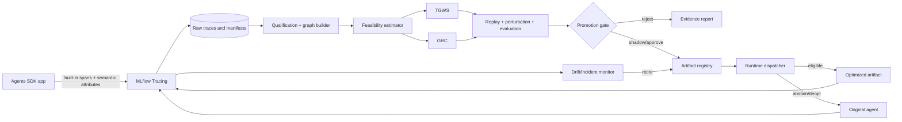
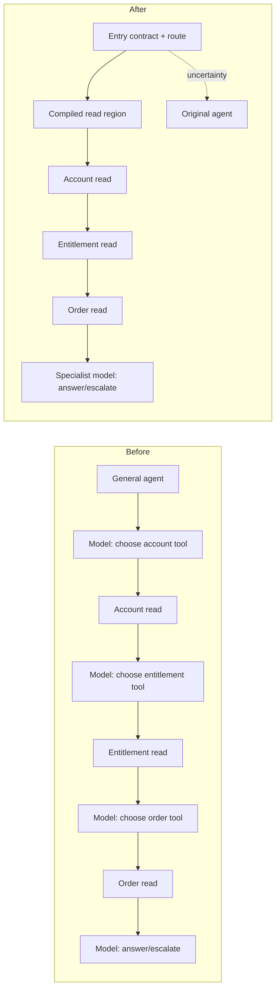
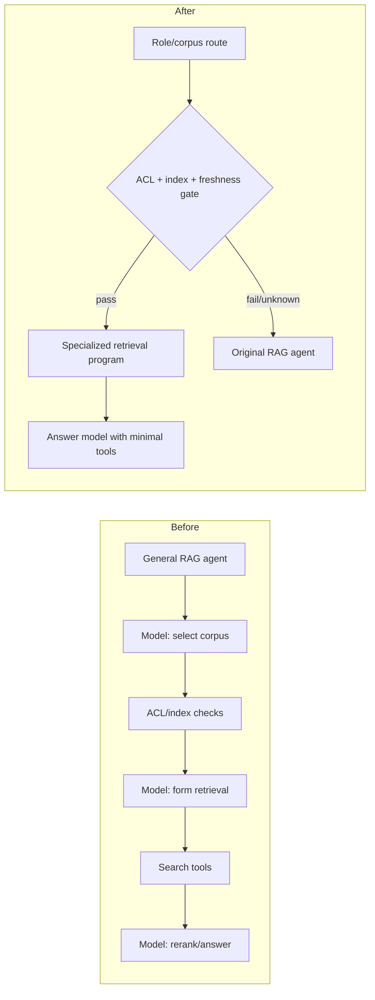
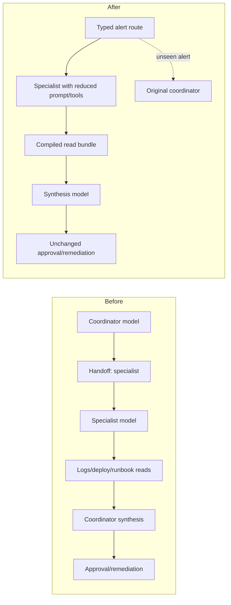

# Agent Compaction: Execution Plan

**Status:** implementation and research plan  
**Date:** 2026-08-01  
**Foundation:** OpenAI Agents SDK + MLflow Tracing  
**Outcome:** a versioned, evidence-gated system that learns from historical traces and makes agent workflows smaller, faster, cheaper, and more predictable without changing model weights

This plan synthesizes every Markdown document in the repository: `proposal.md`, `proposal.v1.md`, and `use-cases.md`. It distinguishes proposed work from measured evidence and resolves conflicts in favor of the current v2.1 proposal.

## 1. Executive Summary

Agent Compaction is an offline workflow optimizer for applications built with the OpenAI Agents SDK and observed through MLflow Tracing. It mines repeated execution patterns, proposes smaller strategies, validates them on grouped historical and adversarial cases, and deploys only immutable artifacts with conservative fallback to the original workflow.

Build two complementary optimizers:

1. **Trace-Guided Workflow Specialization (TGWS):** learn a shallow, interpretable route from entry-state facts to a specialist prompt and minimal tool surface. It removes irrelevant instructions and tools, shortens common handoff paths, and abstains when the route or input is uncertain.
2. **Guarded Region Compilation (GRC):** find repeated multi-step read-only regions, prove that tool arguments derive from entry state and prior observations, synthesize a bounded deterministic program, and dispatch only under a calibrated contract gate.

TGWS is the faster, lower-risk product algorithm; GRC is the principal research contribution. Apply them as a ladder: simplify routing and prompt/tool surfaces first, then compile residual regions that still require repeated model-mediated control. Neither algorithm invents business logic, changes model weights, or removes external effects without an explicit declaration.

Do not create a parallel instrumentation stack. The Agents SDK remains the execution substrate and source of runtime span semantics. MLflow remains the trace store, search/evaluation surface, prompt/version record, and experiment registry. Agent Compaction adds only facts neither can infer—principal, policy/effect class, external-state version, approval scope, and business outcome—and derives a typed graph offline.

Delivery order:

- Weeks 1–4: trace contract, effect catalog, data audit, feasibility estimator.
- Weeks 5–9: GRC miner, bounded synthesizer, contract induction, replay harness, registry.
- Weeks 10–13: TGWS, runtime adapters, shadow mode, promotion/retirement controls.
- Weeks 14–18: three demonstrations, grouped experiments, statistics, hardening, reproducibility bundle, paper draft.

The first release succeeds if it can produce trustworthy negative results as well as positive ones. Each candidate must report feasibility, blocking boundaries, expected savings, validation cost, and evidence for promotion or rejection. The 5–10% request reductions in `use-cases.md` are illustrative hypotheses, not measurements.

The production go/no-go target is deliberately modest: on an eligible workload, a promoted artifact should reduce model-request ratio below `0.90` or deliver a clearly valuable latency/tool-surface gain while passing quality non-inferiority, safety invariance, grouped reliability, and rollback tests. The current evidence cannot support a universal 20% cost claim.

## 2. Problem Statement

Agent applications often spend model calls on control flow rather than irreducible judgment: choosing a predictable tool, translating stable state into arguments, handing off to the same specialist, formatting repeated evidence, or rechecking entry-state invariants. The optimization target is the **workflow**, including prompts, exposed tool schemas, handoffs, graph topology, serial dependencies, repeated regions, and the number of model decisions required for common cases.

Let an episode be a typed graph

\[
\tau=(V,E,x_0,y,m),
\]

where `V` contains agent, model, tool, guardrail, handoff, and approval events; `E` contains control, data, and effect-order edges; `x_0` is entry state; `y` contains task/business outcomes; and `m` is the immutable execution manifest.

Given grouped episodes `D`, find a transformation `a` minimizing

\[
J(a)=\mathbb{E}[C_{req}+\lambda_tC_{tokens}+\lambda_lC_{latency}+\lambda_sC_{surface}],
\]

subject to task-quality non-inferiority, no safety/permission/effect regression, replay consistency, a calibrated unsafe-dispatch bound, and tested fallback. Missing effect or authorization semantics make a candidate ineligible; absence of logged failures is not proof of safety.

Research questions:

- **RQ1 — Discoverability:** How often do real traces contain stable repeated regions or entry-state routes?
- **RQ2 — Groundability:** What candidate actions can be derived without a new semantic model decision?
- **RQ3 — Generalization:** Do grouped replay, perturbations, and calibrated gates predict sealed-test behavior?
- **RQ4 — Utility:** After gate, validation, and fallback overhead, are requests, tokens, latency, variance, or maintenance surface reduced?
- **RQ5 — Explainability:** Can each rewrite be represented as a small route, binding program, contract, and evidence report?

Non-goals: weight optimization; hidden chain-of-thought capture; unrestricted program synthesis; duplicated production effects; removal of approvals, payments, writes, messages, or permission checks; live self-modifying workflows; and universal savings claims.

## 3. Motivation

The missing capability is not another trace viewer. It is a reproducible loop that turns execution evidence into a conservative proposal, compares that proposal with the original workflow, and manages it as a versioned artifact. Benefits include fewer model round trips, lower tail latency and transient-failure exposure, smaller tool surfaces, inspectable contracts, reproducible workflow evolution, and early rejection of uneconomic workloads.

Scientifically, frequency is not equivalence. The challenge is combining pattern discovery with value provenance, effect modeling, contract induction, and statistically controlled dispatch. The core question is: **which parts of a successful workflow still require a model decision?**

Repository decisions:

| Topic | Decision | Evidence boundary |
|---|---|---|
| Success endpoint | Request ratio `<0.90`; cost/latency secondary | v2.1 supersedes v1's universal 20% target |
| Optimizers | TGWS plus GRC; GRC has seven bounded internal stages | Concrete v2.1 primitives replace generic v1 passes |
| Experiment | Four scored conditions, grouped splits, sealed test | v2.1 replaces v1's seven-condition design |
| Trace substrate | Agents SDK + MLflow; derived offline graph | No independent runtime tracer |
| Use-case savings | Hypotheses and power-analysis inputs only | `use-cases.md` labels values illustrative |
| Broad transform taxonomy | Future work and baselines | Not evidence those passes exist |
| Continuous improvement | Scheduled immutable epochs with promotion | Never live self-editing |
| Effects | Unknown is ineligible; approvals are barriers | Shared current safety boundary |

At plan inception the repository contained design documents only. The implementation,
tests, simulated benchmarks, and adapters now live alongside this historical executable
specification; current evidence and residual limits are tracked in `readiness.md` and
`gpt-5.6-report.md`.

## 4. Related Work

Agent Compaction lies between prompt optimization, agent scheduling, workflow synthesis, execution provenance, and process mining. Its narrow contribution is typed-trace discovery of model-mediated control that can be replaced by an interpretable guarded artifact and evaluated end to end.

| Area/system | Relevant capability | Remaining gap |
|---|---|---|
| [OpenAI Agents SDK](https://openai.github.io/openai-agents-python/) | Agent loop, tools, handoffs, guardrails, sessions, approvals, tracing | Runtime foundation, not an offline optimizer |
| [MLflow Tracing for OpenAI Agents](https://mlflow.org/docs/latest/genai/tracing/integrations/listing/openai-agent/) | Automatic capture, search, evaluation, experiment lifecycle | Trace substrate, not a provenance-aware compiler |
| [DSPy](https://github.com/stanfordnlp/dspy) / [MIPRO](https://arxiv.org/abs/2406.11695) | Instruction/example optimization for LM programs | Adjacent proposer; less explicit about effect-safe graph replacement |
| [LLMCompiler](https://proceedings.mlr.press/v235/kim24y.html) | Parallel tool-call planning/execution | Optimizes current scheduling, not historical guarded rewrites |
| [LangGraph](https://github.com/langchain-ai/langgraph) | Explicit durable workflow graphs | Runtime/export target; does not prove a model decision removable |
| [AutoGen](https://github.com/microsoft/autogen) / [CrewAI](https://github.com/crewAIInc/crewAI) | Multi-agent orchestration | Substrates/comparators rather than trace-driven compilers |
| [Execution provenance survey](https://arxiv.org/abs/2606.04990) | Typed execution provenance and evidence projections | Motivates event/data/effect/evidence edges; no compaction implementation |
| Process mining | Repeated paths, variants, bottlenecks | Needs value provenance, manifests, and effect constraints for agents |
| CEGIS/superoptimization | Counterexample-guided smaller programs | Unrestricted search is too broad; GRC uses a closed DSL |
| Partial evaluation | Specialization using known inputs | Compiler analogy for route and binding specialization |

Precise gap: no surveyed system jointly reconstructs typed agent execution, establishes value groundability, treats effects/permissions/freshness as barriers, uses bounded explainable synthesis, performs grouped replay and calibration, and emits immutable fallback-capable artifacts.

Weeks 1–3 must produce `docs/related-work-matrix.md` plus runnable adapters for DSPy/MIPRO, LLMCompiler-style parallel scheduling, and a hand-written deterministic baseline. Record versions, licenses, budgets, task fit, and comparability; listing a repository is not evaluating it.

## 5. System Architecture

Principles: one authoritative trace path; raw-trace preservation; offline optimization; explicit effect semantics; fail-closed dispatch; evidence-bearing immutable artifacts.



| Component | Responsibility | Initial choice |
|---|---|---|
| Capture | Configure tracing and semantic attributes | Agents SDK tracing + `mlflow.openai.autolog()` or one composed processor |
| Store | Raw traces, manifests, labels, artifact links | MLflow backend + object storage/Parquet |
| Graph builder | Typed control/data/effect graph | Pydantic, Polars/DuckDB; NetworkX only for inspection |
| Effect catalog | Effect, replay, auth, freshness, approval rules | CI-validated versioned YAML |
| Estimator | Headroom, support, groundability, sample cost | Python library/CLI |
| TGWS | Shallow route and prompt/tool pruning | Bounded tree + greedy elimination |
| GRC | Mine, synthesize, contract, emit | Closed DSL + deterministic enumeration |
| Evaluation | Replay, perturbation, staging, statistics | Isolated fixtures + MLflow evaluation records |
| Registry | Artifact/evidence lifecycle | MLflow artifacts plus small SQL index |
| Runtime | Dispatch, stage, deopt, telemetry | Custom SDK `Model`/`ModelProvider` or explicit wrapper |

The control plane freezes snapshots, builds candidates, validates, approves, promotes, and retires them. The data plane loads an approved version at a controlled epoch, checks compatibility/contract, and falls back before any non-stageable effect. Lifecycle:

`discovered → synthesized → replay_validated → shadow → approved → active → retired`.

Any code, prompt, model, tool-schema, effect-catalog, policy, or guardrail drift invalidates the compatibility hash. MLflow stores searchable identity/evaluation/experiment records; object storage retains large payloads and normalized Parquet; the compiler graph is a reproducible derived view, not native MLflow semantics.

## 6. Trace Collection Design

The SDK already traces runner/task boundaries, turns, generations, functions, guardrails, and handoffs. MLflow captures Agents SDK execution, inputs/outputs, calls, and guardrails. Add only application-owned facts:

| Field | Purpose | Rule |
|---|---|---|
| Entry state | Values legally available to a rewrite | Typed, allowlisted, redacted |
| Principal/tenant partition | Avoid cross-scope evidence leakage | Stable pseudonym, never a secret |
| Effect class | Separate replay-safe reads from commitments | Versioned catalog declaration |
| External-state version | Establish compatible freshness | Index/DB/API version or digest |
| Approval scope | Preserve exact approved action | Approval digest and typed scope |
| Business outcome | Evaluate task quality beyond syntax | Asynchronous join by episode ID |
| Manifest | Prevent incompatible pooling | Freeze at episode start |

Minimum derived schema:

```text
TraceEnvelope(trace_id, episode_id, group_id, entry_state_ref,
              manifest_id, outcome_ref, privacy_class)
ExecutionManifest(commit, sdk/mlflow/model configs, prompt versions,
                  tool hashes, guardrail/policy/effect versions)
EventNode(node_id, parent_id, kind, actor, timing, input/output refs,
          status, usage, request/call ids, attributes)
Edge(source, target, kind=CONTROL|DATA|EFFECT_ORDER|EVIDENCE,
     field_path, transform_hint, derivation_version)
EffectSpec(tool, class=PURE|READ|WRITE|EXTERNAL|UNKNOWN, idempotency,
           replay, stageability, auth/freshness/literal-only fields, approval)
OutcomeLabels(task_success, semantic_score, safety_events, business_metrics)
ExecutionRecord(candidate/artifact ids, gate/fallback, staged/committed effects,
                latency, usage, incidents)
```

Use content-addressed payload references. Establish data edges from exact typed values, declared mappings, and schemas. Fuzzy text similarity may propose a mapping for review but cannot prove groundability.

The optimizer does not capture hidden chain-of-thought. It consumes observable response items, tool calls, handoffs, structured outputs, optional API-exposed reasoning summaries, and outcomes. Private reasoning is neither needed nor reconstructed.

An episode is compiler-eligible only with complete boundaries/manifest, reconstructable order, typed tool I/O, declared candidate effects, a leakage-resistant group ID, appropriate outcomes, and no unresolved truncation or missing spans. Incomplete traces may inform operations but not equivalence claims.

Privacy rules: allowlist payloads; redact/tokenize PII before storage; encrypt data and separate service identities; partition behavioral evidence by authorization scope; propagate deletion tombstones to datasets/artifacts; never store credentials or unrestricted document content in manifests.

Every snapshot emits a data-quality report covering completeness, manifest/effect coverage, group cardinality, outcome-label latency, duplication, schema drift, scope coverage, and candidate-region mass.

## 7. Agent Compaction Pipeline

Pipeline: freeze immutable range → qualify → normalize → partition → estimate → measure simple engineering baseline → specialize with TGWS → compile residual regions with GRC → validate → calibrate → shadow → approve/promote → monitor → retire/recompile.

The estimator reports baseline distributions; candidate frequency `φ`; eligible gate coverage `ρ`; removable requests `k`; failed-attempt overhead; independent group counts; replay/shadow duration; optimistic/conservative savings ceilings; blockers; and cheapest remediation. A necessary headroom test is

\[
\phi\rho k \ge \Delta n_B,
\]

where `n_B` is baseline requests per episode and `Δ` the target reduction.

Apply transformations in risk order: measure-only estimator; deterministic batching/parallelization or hand-written helper; TGWS; GRC; and only later transactional stageable writes. Stop when a cheaper step captures the benefit. Never credit GRC for savings obtainable from a prompt edit or parallel executor.

Replay modes:

| Mode | Permitted behavior | Evidence |
|---|---|---|
| Recorded-response replay | No external calls; use historical observations | Binding, structural equivalence, gate behavior |
| Live shadow | Baseline performs real work; candidate commits nothing | Coverage, agreement, latency, drift |
| Staging sandbox | Explicit isolated reads/writes | New-path/failure behavior |
| Controlled canary | Narrow live scope under approved effect policy | Operational impact and incidents |

Production replay must never duplicate a write, payment, message, approval, or non-idempotent call. Recorded replay cannot prove a new call ordering works against live state.

Each artifact contains its graph, DSL/program, gate, types, principal/policy/freshness requirements, effect policy, compatibility hashes, dataset split IDs, metric report, counterexamples, fallback reasons, owner, approval, expiry, monitoring thresholds, and rollback target.

## 8. Selected Optimization Algorithms

### 8.1 Algorithm A: Trace-Guided Workflow Specialization (TGWS)

#### Intuition

Many workflows use a broad general agent even though entry-state facts make the appropriate route predictable. A support channel, authenticated role, product family, request type, or existing classifier result may determine the specialist agent and required tools. TGWS learns a small route tree and then removes prompt blocks and tool schemas that are irrelevant within each stable route. It is partial evaluation applied to an agent configuration.

This algorithm is intentionally more constrained than general prompt search. It may select existing prompt blocks, demonstrations, agents, tools, and model/reasoning configurations, but it may not generate new policy text in v0.1. Every leaf is human-readable, and uncertain or out-of-domain inputs use the baseline.

#### Inputs and outputs

Inputs: qualified traces, typed entry-state features, baseline prompt decomposed into named blocks, tool catalog, handoff targets, outcome labels, manifest partitions, and guardrail/effect policy.

Output per route leaf:

- predicate conjunction and minimum support;
- selected specialist/agent and model/reasoning configuration;
- ordered prompt-block set and tool allowlist;
- expected route, request, token, latency, and quality metrics;
- abstention checks, compatibility manifest, and baseline fallback.

#### Procedure

1. Partition by manifest and hard policy fields.
2. Encode only stable entry-state features available before the first model decision; exclude post-outcome or proxy-leakage fields.
3. Fit a decision tree of depth at most three to predict a stable route label (handoff target, tool family, or canonical path). Require minimum leaf support and predeclared purity.
4. Reject features/routes failing temporal and subgroup stability checks.
5. For each accepted leaf, start with the baseline configuration. Iteratively propose removing one prompt block, tool schema, handoff option, or unnecessary reasoning tier.
6. Evaluate each proposal on grouped development cases. Accept the removal only if it improves the objective and passes quality/safety non-inferiority.
7. Re-evaluate the final leaf on calibration data; choose route-confidence and out-of-domain thresholds without looking at sealed test.
8. Package accepted leaves plus an explicit default-to-baseline branch.

```text
TGWS(D_train, D_dev, config, constraints):
  tree = bounded_route_tree(entry_features, observed_routes,
                            max_depth=3, min_support=s_min)
  artifacts = []
  for leaf in stable_high_purity_leaves(tree):
      c = config
      repeat:
          proposals = remove_one(prompt_block | tool | handoff | reasoning_tier, c)
          valid = [p for p in proposals if noninferior(p, D_dev[leaf], constraints)]
          if valid is empty: break
          c = argmin_objective(valid)
      artifacts.append(package(leaf.predicate, c, fallback=config))
  return artifacts
```

#### Complexity

For `n` episodes, `d` features, and a bounded-depth tree, fitting is approximately `O(nd log n)` for standard implementations and strictly bounded by depth. If `q` removable configuration elements and each evaluation over `e` cases costs `E(e)`, one backward-elimination pass is `O(qE(e))`; worst-case iterative elimination is `O(q²E(e))`. Cap evaluation with a fixed budget, cache identical model/tool results where valid, and stop after no meaningful objective improvement.

#### Tradeoffs

- High explainability and low runtime overhead, but limited to routes predictable at entry.
- Pruning reduces prompt/schema tokens and accidental selection surface, but may remove rare capabilities; abstention and sealed rare-case sets are essential.
- Route labels learned from historical handoffs may reproduce a bad workflow. Compare against task outcomes, not mere path imitation.
- Greedy pruning can miss interacting removals. That is acceptable for v0.1; MIPRO/DSPy can be an evaluation-only future proposer.
- A specialized workflow can be less maintainable if too many leaves are emitted. Limit active leaves and require a net complexity reduction.

#### Expected impact and roadmap

TGWS should ship after the estimator and alongside shadow runtime support. Its primary expected gains are prompt/tool-schema token reduction, fewer predictable handoffs, and lower variance. Treat model-request reduction as workload dependent. Start with route-only artifacts, then tool pruning, then prompt-block/reasoning-tier specialization.

### 8.2 Algorithm B: Guarded Region Compilation (GRC)

#### Intuition

GRC replaces a repeated model-mediated region only when the region is a bounded program over facts already observable at entry or produced by permitted in-region reads. It does not memorize tool arguments or infer arbitrary code. It reconstructs value provenance, finds canonical repeated windows, synthesizes bindings from a closed library, induces a contract, and dispatches only when a statistically calibrated gate accepts.

Although GRC has seven internal primitives, it is one end-to-end optimizer:

1. provenance-aware typed graph construction;
2. canonical-window mining;
3. closed-library binding synthesis;
4. typed decision-list synthesis for observed branches;
5. contract induction and counterexample generation;
6. exact gate calibration;
7. staged dispatch and deoptimization.

#### Eligibility

A candidate region must be single-entry and single-exit, but that condition alone is insufficient. Every tool argument and emitted field must be either a literal validated as invariant or a bounded transform of entry state or earlier in-region observations. Tools must be `PURE` or replay-permitted `READ` in v0.1. Unknown effects, approvals, writes, external commitments, unresolved authorization, or incompatible freshness terminate the region.

#### Primitive 1: provenance graph

Seed the value graph with every allowlisted entry-state field. For each observed argument/output field, record all exact candidate producers, not just the nearest matching string. Add typed transform candidates only from the DSL. Ambiguity remains explicit and increases contract risk; a convenient match is never treated as proof.

#### Primitive 2: canonical-window mining

Linearize each trace by causal order while preserving parallel branches. Generate bounded windows of length `2…L` over model/tool/handoff nodes, stopping at effect or approval barriers. Canonicalize variable values to typed slots while retaining tool identity, schema version, control edges, and data-flow shape. Count signatures by independent group rather than raw episode count. This costs `O(NL)` for `N` eligible events and fixed `L`, avoiding general subgraph isomorphism.

#### Primitive 3: closed-library binding synthesis

For each slot, enumerate expressions from a fixed typed library with maximum depth two. Initial operators:

`field`, `literal`, `coalesce`, `get`, `index`, `concat`, `lower`, `upper`, `strip`, `split`, `join`, `replace`, `prefix`, `suffix`, `format`, `cast`, `parse_date`, `date_add`, `json_select`, `length`, `contains`, and `lookup_enum`.

The exact library is versioned and deliberately small. Rank expressions by correctness across training observations, then minimum description length. A slot with no unique zero-error expression is ungroundable. High-entropy literal fields are rejected even when a finite sample happens to repeat.

#### Primitive 4: typed decision list

Observed branches are represented as a short decision list over typed predicates such as equality, membership, presence, numeric range, or string prefix. Require at least 20 independent groups per accepted branch initially, maximum depth/length, zero training violations for hard semantic fields, and a permutation test against a support-only explanation. Unmodeled branches deopt.

#### Primitive 5: contract induction

Create preconditions for types, required fields, value ranges, principal/policy partition, tool/effect versions, authorization, external-state freshness, and branch coverage. Challenge the contract with grouped held-out replay and metamorphic perturbations: delete optional fields, alter formatting, vary irrelevant text, cross boundary values, permute list order where semantics allow, and introduce schema-version mismatches. Counterexamples either refine the contract or reject the candidate; they do not trigger unbounded synthesis.

#### Primitive 6: fixed-grid calibration

Define an observable risk score from contract violations, unseen categories, provenance ambiguity, route distance, and drift. Predeclare a finite threshold grid. On calibration groups, measure unsafe dispatch for each threshold and use one-sided Clopper–Pearson bounds with Bonferroni correction across the grid. Select the highest-coverage threshold whose upper bound is below the risk budget. Report when sample size makes the desired bound impossible.

#### Primitive 7: staged execution and deopt

At runtime: verify compatibility → evaluate gate → evaluate bindings → issue permitted reads → validate results → stage output → commit only within policy. Any failure before external commitment returns control to the original agent with the original entry state plus safely reusable read observations. Once a non-stageable effect is committed, fallback is incident recovery, not exact deoptimization; v0.1 therefore excludes such effects.

```text
GRC(snapshot, manifest, effect_catalog):
  graphs = build_typed_provenance_graphs(qualified(snapshot))
  windows = canonical_windows(graphs, max_len=L, stop_at=effect_barrier)
  for family in group_by_signature_and_policy(windows):
      if independent_support(family) < s_min: continue
      bindings = synthesize_slots(family.train, dsl_depth<=2)
      branches = synthesize_decision_list(family.train)
      if not fully_grounded(bindings, branches): continue
      contract = induce_contract(family.train, bindings, branches)
      contract = challenge(contract, family.dev, perturbations)
      if replay_noninferior(contract, family.dev):
          gate = calibrate_fixed_grid(contract, family.calibration)
          emit(program, contract, gate, compatibility, fallback)
```

#### Complexity

Graph construction is linear in events and candidate field comparisons after hashing/indexing. Window generation is `O(NL)`. If the DSL has `b` type-compatible primitives and depth `h≤2`, naive expression enumeration is `O(b^h)` per slot, further reduced by type checking, memoized denotations, and observational equivalence. Decision-list search is bounded by fixed predicates and depth. Replay cost generally dominates compute and must be reported separately.

#### Tradeoffs

- GRC is explainable and auditable but intentionally incomplete; many valid optimizations will be rejected.
- Exact historical binding does not prove future validity; contracts and fallback reduce but do not eliminate distribution-shift risk.
- Read-only focus gives a credible safety boundary but limits savings on write-heavy agents.
- Strict tenant/principal partitioning lowers support and may make the compiler uneconomic; that is a correct outcome.
- Short windows avoid exponential mining but miss long-range restructuring. Extend only after the bounded system is validated.
- The compiler may cost more to build and maintain than it saves below roughly tens of thousands of episodes per day; the estimator and hand-written baseline are therefore mandatory.

#### Expected impact and roadmap

GRC targets removal of one or more model requests from frequent regions. The repository's illustrative cases imply a plausible single-digit to low-double-digit request reduction, not a guaranteed result. Ship read-only recorded replay first, then shadow dispatch, then narrow live reads. Defer stageable writes, recursive regions, and online adaptation.

### 8.3 Why these two algorithms

Together they cover the main requested workflow dimensions without an unbounded optimizer: TGWS addresses prompts, tool selection, handoffs, topology, and reasoning tier; GRC addresses repeated execution graphs and tool-argument mediation. Both are interpretable, support offline grouped evaluation, and default to baseline. General prompt generation, arbitrary graph rewriting, and reinforcement learning would expand search and safety requirements before the trace/evaluation foundation has been demonstrated.

## 9. Mathematical Formulation

### 9.1 Artifact utility

For baseline `B` and candidate `A`, define per-episode resource vector

\[
r=(n_{req},t_{in},t_{out},\ell_{50},\ell_{95},n_{tools},s_{tools}),
\]

where `s_tools` is exposed tool-schema size. Candidate utility is

\[
U(A)=Q(A)-\lambda^\top r(A)-\lambda_v Var(Y_A)-\lambda_m M(A),
\]

where `Q` is a predeclared task-quality score and `M` measures maintenance complexity (active leaves, prompt variants, DSL nodes, and compatibility rules). Optimize `U` on development data, not test.

### 9.2 Groundability

For every required candidate slot `z_j`, require an expression `e_j` from DSL `\mathcal{L}_{≤2}` such that

\[
\forall \tau\in D_{train}: e_j(x_0,o_{<j})=z_j(\tau),
\]

where `o_<j` are permitted earlier observations. Then require held-out agreement plus perturbation stability. The training equality is a synthesis condition, not an equivalence theorem.

### 9.3 Expected request savings

Let `φ` be candidate frequency, `ρ` dispatch coverage, `k` requests removed on success, `g` gate requests (normally zero), `w` expected requests wasted by failed/deoptimized attempts, and `n_B` baseline requests. Then

\[
\mathbb{E}[n_A]=n_B+g-\phi\rho k+w,
\qquad
R_{req}=\frac{\mathbb{E}[n_A]}{\mathbb{E}[n_B]}.
\]

The primary efficiency endpoint is `R_req`; the target is `<0.90` on at least one predeclared eligible demonstration. Also report absolute difference and group-bootstrap confidence interval.

### 9.4 TGWS objective

For route leaves `r`, configuration `c_r=(P_r,T_r,H_r,M_r)`, and abstention function `a(x)`, solve

\[
\min \sum_r p_r[\alpha n_{req}(c_r)+\beta tokens(c_r)+\gamma latency(c_r)+
\eta |T_r|+\mu complexity(c_r)]
\]

subject to, on accepted cases,

\[
Q(c_r)\ge Q(B)-\epsilon_Q,
\quad Safety(c_r)\ge Safety(B),
\quad Coverage_r\ge c_{min}.
\]

The implementation approximates this constrained problem with bounded trees and greedy backward elimination.

### 9.5 Calibration and non-inferiority

For threshold `t` and `n_t` accepted calibration groups with `e_t` failures, compute one-sided Clopper–Pearson upper bound `u_t` at `α/|T|` for fixed grid `T`. Accept thresholds with `u_t≤δ`, and select maximum coverage according to the predeclared rule. Quality non-inferiority uses a paired, group-aware interval for `Q_A-Q_B`; pass only when its lower bound exceeds `-ε_Q`. Safety endpoints are not averaged into utility: any predeclared critical regression fails the candidate.

### 9.6 Economic break-even

For annual engineering/compute cost `C_build`, eligible annual episodes `N`, per-episode monetary saving `s`, and artifact maintenance cost `C_maint`, require

\[
Ns > C_{build}+C_{maint}.
\]

Report the break-even traffic under low/base/high cost assumptions. The v2.1 proposal's illustrative calculation—about 10 million episodes/year or 27,000/day for a full compiler—must be recomputed using actual team and model costs before investment approval.

## 10. Implementation Plan

### 10.1 Work packages and acceptance criteria

| Package | Deliverables | Acceptance criterion |
|---|---|---|
| WP1 Trace contract | Schemas, MLflow/SDK adapter, manifest, redaction, fixtures | Complete local trace reconstructs exactly; no duplicate trace path |
| WP2 Effect catalog | YAML schema, decorators, CI validator, unknown-effect diagnostics | Every demo tool classified; unknown blocks compilation |
| WP3 Graph/estimator | Normalizer, provenance edges, data report, CLI/report | Synthetic truth graph round-trips; savings ceiling matches fixtures |
| WP4 GRC | Window miner, DSL, enumerator, decision list, contracts | Recovers planted regions and rejects planted ungroundable/effectful ones |
| WP5 Evaluation | Group splitter, replay, perturbations, statistics | Leakage tests pass; no replayed production effects possible |
| WP6 Registry/runtime | Lifecycle, signatures, compatibility, shadow/deopt | Fault injection always falls back before commitment |
| WP7 TGWS | Route tree, pruning runner, config artifact | Rare/uncertain routes abstain; accepted leaves pass dev constraints |
| WP8 Demos/paper | Three apps, datasets, dashboards, artifact bundle | One-command reproduction of tables/figures from frozen data |

### 10.2 Public Python interface

```python
import agent_compaction as ac

ac.capture.configure_mlflow(
    experiment="support-agent",
    entry_state_allowlist=["channel", "locale", "product"],
    effect_catalog="configs/effects.yaml",
)

report = ac.estimate(
    experiment="support-agent",
    window="2026-06-01/2026-06-30",
    partition_by=["manifest_id", "tenant_partition", "policy_version"],
)

job = ac.optimize(
    report.snapshot_id,
    algorithms=["tgws", "grc"],
    mode="offline",
    constraints="configs/promotion.yaml",
)

ac.validate(job.candidate_id, suites=["replay", "perturbation", "shadow"])
ac.promote(job.candidate_id, stage="shadow")
```

The API must expose `partition_by`, `mode`, allowed effects, literal-only fields, maximum transform depth, and terminal handoff rules. These are known gaps in the current proposal examples and cannot remain implicit.

### 10.3 Service endpoints

Provide a CLI first. Add a control-plane service only when multiple teams need it:

- `POST /v1/snapshots` and `GET /v1/snapshots/{id}/quality`;
- `POST /v1/estimate-jobs`, `POST /v1/optimization-jobs`;
- `GET /v1/candidates/{id}` and `/evidence`;
- `POST /v1/candidates/{id}:validate|promote|retire`;
- `GET /v1/artifacts/{id}/manifest`;
- `POST /v1/runtime-events` for dispatch/deopt/incident telemetry.

All mutating calls require authenticated identity, idempotency key, audit record, and role-specific authorization. Promotion requires a human approval distinct from the optimization job identity.

### 10.4 Runtime integration

Support two paths:

1. an explicit `CompactingRunner` wrapper for easiest debugging and exact control around entry state;
2. a custom Agents SDK `Model`/`ModelProvider` for applications wanting transparent interception at model-request boundaries.

Start with the wrapper. It has clearer semantics when a region spans tools or handoffs. The custom model path should only intercept patterns whose deopt state is provably reconstructable. Flush traces during short-lived jobs and verify SDK/MLflow processor composition in integration tests.

### 10.5 CI/CD and versioning

- Semantically version schemas, DSL, effect catalog, and artifact format.
- Rebuild candidates when prompt, tool schema, policy, guardrail, effect, or entry-state contract changes.
- Run unit, property, golden-trace, mutation, replay, and fault-injection tests.
- Prevent a candidate from promoting on the same dataset used to synthesize or tune its gate.
- Sign artifacts and store build provenance/SBOM.
- Canary by explicit tenant/principal/app version; provide a global kill switch.
- Keep original workflow and previous artifact warm for rollback.

### 10.6 Testing strategy

Use synthetic trace generators with planted routes, provenance, ambiguities, effects, missing spans, drift, and counterexamples. Property tests assert that no accepted expression depends on unavailable data; effect barriers are never crossed; group split membership is disjoint; and deopt before commitment is observationally equivalent to baseline entry. Golden traces cover SDK/MLflow version updates. Mutation tests intentionally change prompts/schemas/policies and must invalidate artifacts.

## 11. Experimental Design

### 11.1 Claims and hypotheses

- **H1 (primary feasibility):** Full Agent Compaction attains `R_req<0.90` on at least one predeclared eligible demonstration while passing quality and safety gates.
- **H2 (quality):** Accepted optimized episodes are non-inferior to baseline on the task score within domain-specific margin `ε_Q`.
- **H3 (predictive gate):** Calibration upper bounds control unsafe dispatch on sealed test within the predeclared risk budget.
- **H4 (ablation):** Provenance/contract-aware selection has fewer unsafe dispatches than support-only selection at comparable coverage.
- **H5 (operations):** Active artifacts reduce tail latency or variance without increasing incident rate; exploratory unless traffic is sufficient.

### 11.2 Four scored conditions

1. **Original baseline:** unchanged Agents SDK workflow.
2. **Simple optimization baseline:** hand-written macro, parallel scheduling, or AWO-style repeated-path optimization with the same effect boundary.
3. **Full Agent Compaction:** TGWS then GRC with provenance, contracts, and calibration.
4. **Support-only ablation:** same candidate frequency threshold but without provenance-aware risk gating.

Prompt/tool pruning may also be reported separately as an internal decomposition of condition 3, but avoid multiplying confirmatory conditions. DSPy/MIPRO can be an exploratory comparator under an equal optimization budget.

### 11.3 Data splits

Split by scenario/customer case/task seed, never individual spans. Near-duplicate prompts, templates, documents, users, and workflow-generated variants stay in one group. Use chronological holdout when drift is plausible.

- Train: mining, route fitting, synthesis.
- Development: transformation choice, contract refinement, margins.
- Calibration: gate threshold only.
- Sealed test: opened once after artifacts and analysis code are frozen.
- Prospective shadow: operational validation, not pooled into the retrospective test claim.

When scenario IDs do not exist, define conservative `principal + day + case/document hash` groups and perform sensitivity analysis with coarser grouping.

### 11.4 Sample plan

Run a pilot to estimate candidate frequency, paired variance, gate failure, and intragroup correlation. Then determine sample size for the primary paired non-inferiority and request-ratio endpoints. The current proposal's approximate 4,200 episodes is a planning figure, not a fixed scientifically justified number. For rare safety failures, exact upper bounds may require far more calibration groups than quality comparisons; report the attainable bound rather than weakening it post hoc.

### 11.5 Analysis

- Paired differences on the same task instances wherever possible.
- Cluster/group bootstrap confidence intervals for request, token, latency, and quality differences.
- Exact binomial intervals for gate failures and critical safety events.
- Holm correction across secondary endpoints; fixed-grid Bonferroni correction for gate selection.
- Median and p95/p99 latency with bootstrap intervals; geometric mean only for justified ratios.
- Report coverage-risk and savings-quality frontiers, not only one selected threshold.
- Include all eligible episodes in intention-to-dispatch analysis; separately report accepted-case performance.
- Pre-register hypotheses, margins, exclusions, threshold grid, and stopping rules.

### 11.6 Reproducibility

Publish frozen schemas, effect catalogs, synthetic generator, split manifests, artifact manifests, source versions, evaluation code, seeds, environment lock, and table/figure scripts. Where real traces cannot be released, publish de-identified structural traces plus a generator matching reported distributions. Every result table must link to a machine-readable run manifest.

## 12. Demonstration Scenarios

All savings below are targets to measure. They are not inherited results.

### 12.1 Demo A: Tier-1 support evidence gathering

**Task:** A support agent classifies a request, repeatedly fetches account/product/order context, then drafts an answer or escalates. Reads are common and stable; messages/refunds remain outside the compiled region.

**Optimization:** TGWS routes stable product/channel cases to a smaller prompt/tool surface. GRC replaces repeated account → entitlement → order evidence gathering when all IDs are grounded in authenticated entry state or earlier reads.



**Safety boundaries:** authenticated customer/account binding; principal and locale partition; stale or missing records deopt; escalation, refund, and outbound message stay baseline.

**Evaluation:** request ratio, prompt/schema tokens, p95 latency, correct evidence set, answer correctness, escalation accuracy, unsupported-claim rate, and fallback rate. Compare with one hand-written `gather_support_context` tool to determine whether automatic compilation adds value.

### 12.2 Demo B: Permissioned RAG knowledge assistant

**Task:** An enterprise assistant classifies intent, selects corpus/tools, checks ACL/index freshness, performs retrieval, reranks, and answers with citations.

**Optimization:** TGWS specializes by authenticated role and corpus family and removes irrelevant retrievers. GRC compiles stable query-normalization and multi-index read sequences only when ACL, index version, and freshness contract are satisfied.



**Safety boundaries:** ACL checks are never inferred away; no cross-role support pooling; index/version mismatch fails closed; retrieved document content is not used as entry state before retrieval.

**Evaluation:** request/token ratios, retrieval latency, Recall@k/nDCG where labeled, answer correctness, citation support, unauthorized-document exposure (must remain zero), freshness failures, determinism across reruns, and tool-surface size. Compare with parallel retrieval and static router baselines.

### 12.3 Demo C: Multi-agent incident triage

**Task:** A coordinator receives an alert, inspects typed service/severity/environment facts, hands off among log, deployment, and runbook specialists, gathers read-only evidence, and proposes a response. Any remediation action requires approval and stays baseline.

**Optimization:** TGWS removes predictable coordinator turns by routing stable alert families directly to the correct specialist configuration. GRC compiles repeated read-only evidence bundles within a specialist. A handoff remains a real SDK semantic transition when session/instruction ownership changes; it is never silently replaced by a tool call.



**Safety boundaries:** route only on fields known at entry; unseen services/severities deopt; evidence reads declare freshness; approval and remediation are immutable barriers; no automatic operational action.

**Evaluation:** handoff/model-request count, time to evidence, p95/p99 latency, correct specialist, incident classification, evidence completeness, unsafe action attempts, fallback, and graph edit distance. Compare with a handwritten static router and the original coordinator.

### 12.4 Demo selection gate

Instrument all three for a pilot, then run full confirmatory evaluation only on workloads meeting support, group count, groundability, and savings-headroom thresholds. A failed eligibility result remains a reported case study; do not silently replace it after seeing outcomes. The multi-tenant MCP case in `use-cases.md` is an explicit likely negative control because hard partitioning may leave too few groups.

## 13. Evaluation Metrics

No single composite score should hide a quality or safety regression. Report the following families separately and show their frontiers as gate coverage changes.

### 13.1 Efficiency

| Metric | Definition / reporting |
|---|---|
| Model-request ratio | Mean candidate requests divided by paired baseline requests; primary endpoint |
| Requests saved | Paired absolute and percentage change per episode and accepted dispatch |
| Input/output/cached tokens | Separate counts and monetary cost using timestamped provider prices |
| End-to-end latency | Median, p95, p99, paired change, and timeout rate |
| Critical-path latency | Duration along causal critical path, distinct from summed span duration |
| Tool calls | Counts by read/write/external class; no credit for merely shifting unnecessary calls |
| Tool-surface size | Tool count plus serialized schema tokens visible to each model request |
| Gate/deopt overhead | CPU time, added latency, wasted calls, and baseline restart cost |
| Carbon/compute proxy | Optional model tokens and offline optimization compute; label as proxy |

### 13.2 Quality and safety

- task-specific semantic score and exact success where meaningful;
- business outcome (resolution, retrieval relevance, correct triage) observed at a declared horizon;
- human blinded pairwise rating on a stratified subset;
- tool-argument and final structured-output equivalence;
- correct permission, guardrail, approval, and freshness behavior;
- unsupported-claim/citation error rate;
- critical effect divergence and incident rate;
- non-inferiority margin, point estimate, and group-aware interval.

Safety-critical events use exact counts and upper bounds. A zero observed event rate is not described as zero risk. Quality evaluators must be validated against expert labels and cannot be the same model/configuration that proposed an optimization without an independent check.

### 13.3 Determinism and robustness

For fixed input and compatible external-state snapshot, repeat baseline and candidate runs and measure:

- exact route, tool sequence, argument, and structured-output agreement;
- semantic output variance and pairwise disagreement;
- latency and request-count coefficient of variation;
- perturbation pass rate by perturbation family;
- out-of-distribution abstention and false-acceptance rates;
- contract coverage, unsafe dispatch, pre-commit deopt, and post-commit incident rates;
- performance by time, tenant/principal partition, route, difficulty, and rare-case stratum.

### 13.4 Maintainability and explainability

Measure active artifact/leaf count, prompt variants, tool allowlists, DSL nodes, contract predicates, compatibility dependencies, generated versus handwritten lines, review time, time to diagnose a failed dispatch, invalidation frequency, rollback time, and developer comprehension in a small blinded task. A rewrite that saves tokens while multiplying fragile configurations can fail the overall utility gate.

### 13.5 Discovery and compiler metrics

- qualified episode and independent-group coverage;
- candidate frequency and unique canonical regions;
- slot groundability and ambiguity rate;
- rejection reasons by stage;
- synthesis time and expressions explored;
- contract size and counterexamples found;
- calibration sample size and attainable risk bound;
- shadow-to-live promotion rate and artifact lifetime;
- precision of predicted savings versus measured savings.

### 13.6 Statistical reporting rules

Use paired/grouped estimators, disclose missing outcomes and exclusions, publish denominators, and show both accepted-only and all-eligible analyses. Freeze metric code before sealed test. Separate confirmatory from exploratory findings. Report negative and retired artifacts. Costs must include offline optimization, shadow traffic, monitoring, engineering, and maintenance—not only model API charges.

## 14. Risks and Limitations

| Risk | Consequence | Mitigation / stop condition |
|---|---|---|
| Trace frequency mistaken for correctness | Compiler reproduces a common defect | Require outcomes, simple baseline, perturbations, sealed test, human review |
| Missing/ambiguous value provenance | Fabricated or stale arguments | Exact typed provenance; ambiguity blocks the slot |
| Undeclared effects or authorization | Duplicate/unauthorized action | Unknown effect fails closed; v0.1 read-only; hard barriers |
| Distribution/schema/policy drift | Previously valid artifact misroutes | Compatibility hashes, drift monitor, expiry, automatic retirement |
| Tenant/principal data leakage | Invalid generalization/security incident | Hard partitioning and scoped artifacts even when support collapses |
| Replay realism | Recorded outputs hide changed call-order behavior | Separate recorded replay from sandbox, shadow, and canary evidence |
| Gate overfitting | Risk bound fails on test/live data | Fixed grid, independent calibration, exact corrected bounds |
| Outcome/evaluator bias | False non-inferiority | Independent expert subset and evaluator validation |
| Optimization shifts work | Fewer requests but more tool calls/latency | End-to-end resource vector and critical-path measurement |
| Artifact proliferation | Operational complexity exceeds savings | Leaf/artifact caps and maintenance penalty |
| Sensitive trace capture | Privacy/compliance harm | Allowlist/redaction, access separation, deletion lineage, retention policy |
| SDK/MLflow integration drift | Missing or duplicate spans | Version matrix and golden integration traces |
| Prompt/tool simplification already suffices | Compiler has no incremental value | Mandatory TGWS/handwritten/parallel baseline; stop GRC investment |
| Low workload volume | Build cost never recovers | Estimator and economic gate before compiler work |
| Hidden long-range dependencies | Short-window rewrite changes semantics | Conservative contract, bounded regions, fallback; reject uncertain cases |
| Post-commit failure | Exact deopt impossible | No non-stageable effects in v0.1; incident path explicitly modeled |

Known design/API gaps that implementation must close:

- partitioning by tenant/principal/policy in compile and estimate APIs;
- explicit offline/replay/shadow/live mode;
- public allowed-effect controls;
- `literal_only` fields for values that may not be derived;
- configurable transform depth with a safe hard maximum;
- field-entropy checks rather than a fragile literal stoplist;
- terminal-emission rules around handoffs;
- staging-owner and commit-point semantics;
- one authoritative Agents SDK/MLflow tracing configuration;
- a precise policy for optional reasoning summaries and sensitive payloads.

Fundamental limitation: empirical validation cannot prove semantic equivalence for all future inputs or external states. The contribution is selective, evidence-bounded replacement with abstention—not verified compilation in the formal-methods sense. The workload may also change faster than sufficient independent calibration evidence accumulates.

## 15. Future Extensions

Only pursue these after the read-only system demonstrates value:

1. Transactional, stageable writes using explicit prepare/validate/commit/compensate protocols.
2. Richer prompt proposals from DSPy/MIPRO under the same independent evaluator and artifact gates.
3. Parallel scheduling of provenance-independent reads, measured separately from model-call removal.
4. Hierarchical or longer regions with bounded dynamic programming rather than general subgraph search.
5. Cross-workflow libraries of reviewed macros without pooling principal-specific behavioral evidence.
6. Online artifact selection via conservative bandits; artifact generation remains offline and immutable.
7. Causal experiments to distinguish truly necessary steps from correlated workflow habits.
8. Explicit support for long-running sessions, memory consolidation, streaming, MCP servers, and terminal handoffs.
9. Multi-language runtimes generated from the same typed DSL.
10. Formal refinement types or model checking for a small subset of contracts/effects.
11. Automatic developer patches or pull requests, always with human review and no direct live mutation.
12. Maintenance-aware optimization that merges or retires redundant specialist leaves.

## 16. Development Milestones

### 16.1 Eighteen-week integrated schedule

| Weeks | Work | Exit gate |
|---|---|---|
| 1–2 | Architecture decision records; source-version matrix; trace/effect/privacy schemas; demo skeletons | Stakeholder approval of semantics and safety boundary |
| 3–4 | Capture adapter, golden traces, qualification report, estimator, synthetic generator | `v0.1-estimator`; at least one demo passes or explicitly fails headroom gate |
| 5–6 | Typed graph, value provenance, canonical windows, effect barriers | Planted graph/mining tests pass; no exponential search |
| 7–8 | DSL enumerator, binding/branch synthesis, contracts, perturbations | Planted valid regions recovered; invalid/effectful cases rejected |
| 9 | Fixed-grid calibration, artifact format, evidence report | `v0.2-compiler`; frozen replay benchmark passes |
| 10–11 | TGWS route tree and prompt/tool/reasoning pruning | Route rare-case and non-inferiority suites pass |
| 12–13 | Registry, runtime wrapper, shadow mode, deopt/fault injection, kill switch | `v0.3-shadow`; no fault crosses commit boundary |
| 14–15 | Run three pilots; freeze eligible demos, splits, hypotheses, analysis | Pre-registration and power analysis complete |
| 16–17 | Confirmatory experiments, ablations, prospective shadow, cost analysis | Sealed test opened once; tables reproducible |
| 18 | Hardening, docs, related-work matrix, artifact release, paper draft | Reproducibility audit and release sign-off |

### 16.2 Decision gates

- **Gate 0 — Data:** at least 95% required-span completeness on the selected workflow, 100% effect classification for candidate tools, sufficient independent groups, and usable outcomes. Otherwise improve capture only.
- **Gate 1 — Economics:** conservative savings ceiling and break-even justify further work. Otherwise ship estimator/report and hand-write the top region.
- **Gate 2 — Synthesis:** candidate is fully grounded, bounded, and effect eligible. Otherwise reject or use TGWS only.
- **Gate 3 — Retrospective evidence:** development and calibration gates pass under the frozen protocol. Otherwise do not shadow.
- **Gate 4 — Shadow:** coverage, agreement, drift, overhead, and operational controls pass for a full predeclared window. Otherwise retire/refine.
- **Gate 5 — Live:** human approval for a narrow canary; automatic stop on compatibility, safety, or quality threshold.

### 16.3 Staffing and dependencies

Minimum core team: one compiler/ML engineer, one agents/runtime engineer, and one evaluation/research engineer, with part-time domain expert, security/privacy reviewer, and production owner. Dependencies include a representative Agents SDK application, MLflow deployment, immutable object storage, stable outcome labels, sandboxable tools, and enough traffic. Without outcome access or effect ownership, only the estimator and trace-quality tooling are feasible.

### 16.4 Definition of done

The research MVP is done only when source, schemas, demo applications, frozen split manifests, all four experimental conditions, artifact/evidence reports, raw aggregate results, figure/table scripts, environment lock, and negative results can be reproduced from a clean checkout. The production MVP additionally requires access controls, audit logs, artifact signing, kill switch, dashboards, incident runbook, rollback exercise, and an owner for every active artifact.

## 17. Repository Structure

```text
agent-compaction/
├── pyproject.toml
├── README.md
├── proposal.md
├── proposal.v1.md
├── use-cases.md
├── execution-plan.md
├── src/agent_compaction/
│   ├── capture/
│   │   ├── mlflow_adapter.py
│   │   ├── attributes.py
│   │   └── manifests.py
│   ├── schema/
│   │   ├── traces.py
│   │   ├── effects.py
│   │   └── artifacts.py
│   ├── graph/
│   │   ├── normalize.py
│   │   ├── provenance.py
│   │   └── windows.py
│   ├── estimate/
│   │   ├── headroom.py
│   │   └── reports.py
│   ├── tgws/
│   │   ├── routes.py
│   │   ├── prune.py
│   │   └── package.py
│   ├── grc/
│   │   ├── dsl.py
│   │   ├── synthesize.py
│   │   ├── contracts.py
│   │   └── calibrate.py
│   ├── evaluation/
│   │   ├── splits.py
│   │   ├── replay.py
│   │   ├── perturb.py
│   │   ├── metrics.py
│   │   └── statistics.py
│   ├── registry/
│   │   ├── store.py
│   │   └── lifecycle.py
│   ├── runtime/
│   │   ├── runner.py
│   │   ├── model_provider.py
│   │   ├── dispatch.py
│   │   └── staging.py
│   ├── cli.py
│   └── api.py
├── configs/
│   ├── effects.schema.json
│   ├── effects.example.yaml
│   ├── promotion.schema.json
│   └── promotion.example.yaml
├── demos/
│   ├── support/
│   ├── permissioned_rag/
│   └── incident_triage/
├── tests/
│   ├── unit/
│   ├── property/
│   ├── integration/
│   ├── golden_traces/
│   ├── mutation/
│   └── fault_injection/
├── experiments/
│   ├── manifests/
│   ├── conditions/
│   ├── analysis/
│   └── figures/
├── docs/
│   ├── architecture/
│   ├── related-work-matrix.md
│   ├── safety-model.md
│   ├── trace-contract.md
│   └── operations.md
└── scripts/
    ├── capture_smoke.py
    ├── generate_synthetic.py
    ├── reproduce.py
    └── verify_release.py
```

Keep raw/private traces outside Git. Commit de-identified fixtures, content hashes, and split manifests. Generated figures and tables must name their source run manifest. Architecture decisions should record why MLflow/SDK integration, read-only scope, bounded synthesis, and calibration choices were made.

## 18. Expected Research Contributions

If implemented and evaluated as specified, the work can make five defensible contributions:

1. **A typed trace-to-workflow representation** that combines Agents SDK execution semantics with value provenance, effect ordering, compatibility manifests, and outcome evidence while retaining MLflow as the observability substrate.
2. **A bounded guarded region compiler** that mines canonical windows in `O(NL)`, synthesizes arguments from a closed typed DSL, and explicitly rejects ungroundable or effect-unsafe candidates.
3. **An interpretable workflow specializer** that jointly studies entry-state routing and route-specific prompt/tool/reasoning reduction under quality constraints.
4. **A selective validation and deployment protocol** combining grouped splits, counterexample perturbations, exact corrected calibration, shadow execution, immutable epochs, and pre-commit fallback.
5. **An empirical characterization of compaction feasibility** across support, permissioned RAG, and multi-agent triage, including negative cases, economic break-even, and comparison with simple engineering baselines.

Claims must match results. If no demo reaches the `<0.90` request ratio but the estimator accurately predicts infeasibility, the contribution becomes trace-grounded feasibility analysis rather than a successful efficiency compiler. If TGWS captures the gains and GRC adds none, report that prompt/tool/topology specialization is the better practical method. If calibration requires prohibitive data, that sample-complexity result is itself important. Do not convert development, illustrative, or shadow evidence into a sealed-test or production claim.

The strongest publication framing is therefore not “agents can always be compiled.” It is: **historical execution provenance can identify a measurable subset of agent control flow that is safely replaceable under explicit groundability, effect, compatibility, and statistical constraints—and can explain when that subset is too small to matter.**

---

## Implementation Readiness Checklist

- [ ] Trace semantics verified against pinned Agents SDK and MLflow versions.
- [ ] One authoritative tracer configured; duplicate-span test passes.
- [ ] Entry-state, manifest, effect, approval, freshness, and outcome schemas frozen.
- [ ] Raw-trace retention, redaction, deletion, and access policies approved.
- [ ] Feasibility estimator validated on planted synthetic workloads.
- [ ] Simple handwritten/parallel baseline implemented before GRC credit.
- [ ] TGWS and GRC candidates emit complete evidence-bearing artifacts.
- [ ] Train/development/calibration/test group isolation automatically checked.
- [ ] Production replay cannot call effectful tools.
- [ ] Shadow and fault-injection suites prove pre-commit fallback.
- [ ] Promotion, expiry, retirement, kill switch, and rollback exercised.
- [ ] Demo targets and hypotheses pre-registered before sealed-test access.
- [ ] All illustrative repository numbers clearly separated from measured results.
- [ ] Paper tables and figures reproduce from frozen run manifests.

## Primary Technical References

- [OpenAI Agents SDK overview](https://openai.github.io/openai-agents-python/)
- [OpenAI Agents SDK tracing](https://openai.github.io/openai-agents-python/tracing/)
- [OpenAI Agents SDK model interface](https://openai.github.io/openai-agents-python/ref/models/interface/)
- [MLflow OpenAI Agents tracing integration](https://mlflow.org/docs/latest/genai/tracing/integrations/listing/openai-agent/)
- [MLflow trace concepts](https://mlflow.org/docs/latest/genai/concepts/trace/)
- [From Agent Traces to Trust: evidence tracing and execution provenance survey](https://arxiv.org/abs/2606.04990)
- [MIPRO: Optimizing Multi-Stage Language Model Programs](https://arxiv.org/abs/2406.11695)
- [LLMCompiler: An LLM Compiler for Parallel Function Calling](https://proceedings.mlr.press/v235/kim24y.html)
