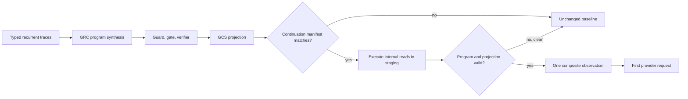

# Guarded Composite Synthesis

Guarded Composite Synthesis (GCS) turns an admitted GRC program into one
task-specific interface. It addresses the strongest macro advantage found by the paper:
a manual composite can return only the evidence the task needs, while the original
compiler exposed each source-tool observation separately.

GCS changes the model-visible interface, not the trusted execution boundary. Every
internal call still executes through `ToolFacade`, retains its declared effect and
provenance, and must pass the ordinary program verifier before any projected result is
released.

## Compile contract

A composite can be emitted only when:

- the underlying program is non-empty and already synthesizable;
- every internal tool is read-like, `speculatable`, `replayable`, and explicitly
  `batchable`;
- every projection source is rooted in a verified program live-out;
- a tool-qualified source resolves to exactly one internal step;
- every exposed input is an admitted `Program.theta` entry-state path; and
- any task-semantic argument normalization is declared in the signed effect catalog.

The projection DSL is the existing bounded binding language. It cannot execute callbacks,
choose dynamic tools, or read arbitrary runtime state.

## Task-semantic arguments

Some tool arguments vary in traces even though the registered task consumes the same
sufficient evidence. `ArgumentSemantics` makes this application fact explicit. Available
normalizers are `clamp_int`, `strip`, `casefold`, `sort_unique`, and finite `aliases`.

For integer normalization, use `admissible_minimum`/`admissible_maximum` to define the
source domain. A value outside that domain raises instead of being silently rewritten.
The compiler does not infer these contracts and cannot prove their business meaning.

## Runtime contract

`CompactingRunner.execute_pre_model()` is the preferred integration point. It asks the
dispatcher for an active pre-model composite and requires the exact continuation
compatibility key. A mismatch executes no tool. On a hit, the runtime:

1. evaluates the ordinary hard guard and calibrated gate;
2. opens the staging boundary;
3. executes and records every internal tool call;
4. verifies call counts, effects, outputs, and provenance;
5. evaluates the bounded projection;
6. commits only after both checks pass; and
7. returns one `CompactedObservation` containing composite arguments and projected output.

A clean failure returns no observation; the host must run the original agent with its
unchanged input. A dirty post-commit failure remains an incident under the existing
staging policy.

## Real validation

Two evidence layers are retained:

- `paper/results/gcs_validation/provider_free.json` reconstructs 132 sealed real-provider
  tool traces against the pinned public GitHub snapshot. The compiled three-read composite
  dispatches on 124 traces, safely falls back on 8, and produces 124/124 exact projections
  with zero provider calls during validation.
- `paper/results/gcs_live/results.json` is a fresh paid comparison on 12 public issues
  excluded from all prior cohorts. GCS and the provider-visible manual macro both pass
  12/12 exact contracts. Relative to that macro, GCS reduces provider requests 50.0%, total
  tokens 38.9%, observed wall latency 40.0%, and estimated cost 32.3%.

The live result is exploratory and single-family. Both conditions expose one interface and
perform three source reads. The measured gain comes from executing the guarded composite
before the first provider request; an equally pre-executed manual macro was not tested.

## Current limits

- Read-only programs only; writes, approvals, handoffs, and unknown effects remain barriers.
- Internal calls execute sequentially; GCS does not add parallel scheduling.
- The application, not the compiler, owns the truth of task-semantic argument contracts.
- No automatic remote endpoint or arbitrary Python macro is generated.
- Pre-model observations require an application adapter for the target agent framework.
- The current evidence covers one GitHub workflow family and one model configuration.
