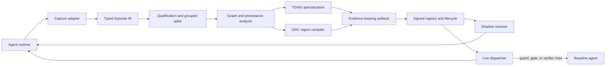

# Library architecture and API

`agent-compaction` is a framework-neutral, offline optimizer with runtime adapters. It
turns observable agent executions into immutable, evidence-bearing artifacts. It does
not train model weights or infer permission to remove effects; missing evidence causes
abstention.

## Architecture



The stable boundary is the typed trace IR, not an SDK or observability vendor. An
`Episode` carries an `ExecutionManifest`, isolation envelope, entry state, observable
events, outcome labels, and usage. Every compilation call accepts one compatibility
identity; `manifest_partitions()` and `compile_grc_batch()` safely handle rolling
deployments without pooling evidence across versions.

## Public workflow

```python
import agent_compaction as ac

episodes = ac.read_jsonl("traces.jsonl")
catalog = ac.load_catalog("effects.yaml")

quality = ac.graph.data_quality(episodes, catalog)
headroom = ac.estimate(
    episodes,
    catalog,
    entry_schema=["channel", "locale", "product"],
)

job = ac.optimize(
    episodes,
    catalog,
    algorithms=["tgws", "grc"],
    entry_schema=["channel", "locale", "product"],
    partition_by=["tenant_partition", "principal", "policy_version"],
    mode="offline",
    sandbox=make_isolated_sandbox,
    tgws_baseline=baseline_configuration,
    tgws_evaluate=measured_evaluator,
)

evidence = ac.validate(job, suites=["replay", "perturbation"])
job.save("artifacts/candidate", signing_key=signing_key)
ac.promote(job, stage="shadow")
```

`optimize()` is the convenient façade. It requires measured TGWS evaluation and rejects
mixed manifests, unknown algorithms, invalid modes, and catalog drift. The lower-level
compilers remain available for research workflows.

## Composable optimization pipelines

`OptimizationPipeline` is the extension layer for prompt, tool, memory, routing, cost,
latency, and execution-plan optimizers. Passes declare capabilities, execute in a fixed
order, and return auditable artifacts, metrics, notes, and an explicit `APPLIED` or
`ABSTAINED` status.

```python
pipeline = ac.OptimizationPipeline([
    ac.TgwsOptimizationPass(
        config=tgws_config,
        baseline=baseline_configuration,
        evaluate=measured_evaluator,
    ),
    ac.GrcOptimizationPass(config=grc_config, sandbox=make_isolated_sandbox),
])

context = ac.OptimizationContext(
    episodes=episodes,
    catalog=catalog,
    manifest=episodes[0].manifest,
    splits=ac.make_splits(episodes),
)
report = pipeline.run(context)
```

A third-party pass implements only:

```python
class MyOptimizer:
    name = "memory_compaction"
    requires = frozenset({"trace_ir", "grouped_splits"})

    def run(self, context: ac.OptimizationContext) -> ac.PassResult:
        # Fit on train/dev, freeze the proposal, calibrate on calibration groups,
        # and never inspect the sealed test while selecting it.
        return ac.PassResult(
            self.name,
            status=ac.PassStatus.ABSTAINED,
            notes=("no safe reduction found",),
        )
```

Passes may share derived analysis through `context.state`, but should expose reusable
facts as named capabilities. A pass must not mutate source episodes or silently weaken a
guard emitted by an earlier pass.

## Implemented components and extension points

| area | implemented surface | extension contract |
|:---|:---|:---|
| Trace collection | JSONL, MLflow transport, OpenAI Agents SDK trace processor | normalize any framework into `Episode` |
| Execution graph analysis | qualification, canonical order, provenance, effect barriers, bounded windows | add graph features without changing observable semantics |
| Workflow optimization | TGWS routes and GRC deterministic read regions | `OptimizationPass` |
| Prompt/tool compaction | TGWS selects existing prompt blocks and tool allowlists | evaluator-backed proposer pass |
| Agent composition | entry-state route to agent/model/reasoning/handoffs | custom `RouteConfig` producer; handoff-spanning GRC is unsupported |
| Memory optimization | trace and pipeline contracts only | add a pass with explicit memory consistency and retention metrics |
| Determinism analysis | repeat agreement, group-aware replay, perturbations, fixed seeds | add workload-specific repeat trials |
| Cost/latency | request, token, cache, dollar, latency, critical-path metrics | custom evaluator and objective |
| Execution planning | closed GRC DSL, route plans, deterministic dispatcher | new artifact kind plus resolver and verifier |
| Evaluation | grouped splits, replay, perturbation, paired intervals, negative controls | workload outcome join and comparator |
| Registry/operations | HMAC integrity, lifecycle, expiry, kill switch, rollback | external atomic registry backend |

Memory optimization, learned model routing, online adaptation, public-key signing, and
cross-framework runtime adapters are extension targets, not implemented production
features. The trace IR and pass protocol are designed so these do not require changing
the core compilers.

## Continuation contracts

Program verification ends at the compiled tool region. If the following model turn owns
the user-visible answer, applications can add a separate fail-closed contract before that
answer is committed:

```python
def factual_contract(output, evidence):
    expected = evidence.observations[0]["result"]
    return [] if output["title"] == expected["title"] else ["title:not_grounded"]

def checked_renderer(evidence):
    expected = evidence.observations[0]["result"]
    return {"title": expected["title"]}

guard = ac.ContinuationGuard(factual_contract, renderer=checked_renderer)
runner = ac.CompactingRunner(
    dispatcher=dispatcher,
    catalog=catalog,
    manifest=manifest,
    continuation_guard=guard,
)

decision = runner.on_continuation(
    candidate_output,
    entry_state=entry_state,
    observations=compiled_observations,
    artifact_id=artifact_id,
    baseline=lambda _evidence: run_original_agent(),  # optional; revalidated
)
if not decision.accepted:
    raise SafeEscalation("no validated continuation is available")
commit(decision.output)
```

The recovery order is checked renderer, then baseline. Both outputs must pass the same
contract. Callback exceptions and invalid recoveries produce `REJECTED` with no output;
telemetry excludes model output and exception messages. The contract is caller-owned
because exact factuality, output schemas, handoff ownership, and regulated-domain policy
cannot be inferred safely from recurrence alone.

## Contracts that extensions must preserve

1. Pin every semantic dependency in `ExecutionManifest`; never pool incompatible keys.
2. Split by independent scenario group, not span or episode row.
3. Fit proposals on train/development data, freeze them, and calibrate thresholds on
   separate calibration groups.
4. Treat unknown effects, writes, approvals, unsupported surfaces, and missing payloads
   as barriers.
5. Publish negative results, evaluation budgets, denominators, and substrate type.
6. Resolve artifacts locally and deterministically; no model call is allowed on the hot
   path.
7. Preserve the tested baseline and make every runtime failure either `BASELINE` or an
   explicit `INCIDENT`.
8. If claiming end-to-end answer preservation, validate the post-region continuation
   separately and commit only an `ACCEPTED`, `RENDERED`, or revalidated `BASELINE` output.

## Versioning and compatibility

The package is `0.x`: public names are usable, but artifact schemas may still evolve.
Artifact validity is intentionally narrower than package compatibility. A change to the
model, prompt, tools, policy, guardrail, effect catalog, entry contract, SDK version, or
tracer version changes the compatibility key and causes runtime abstention until the
artifact is rebuilt and promoted.
