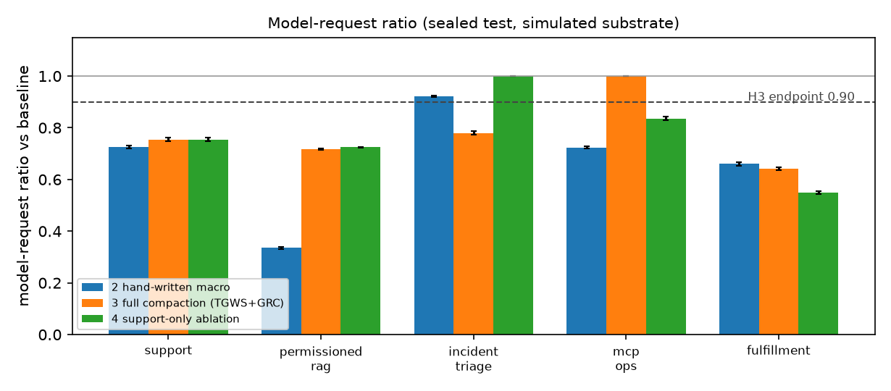
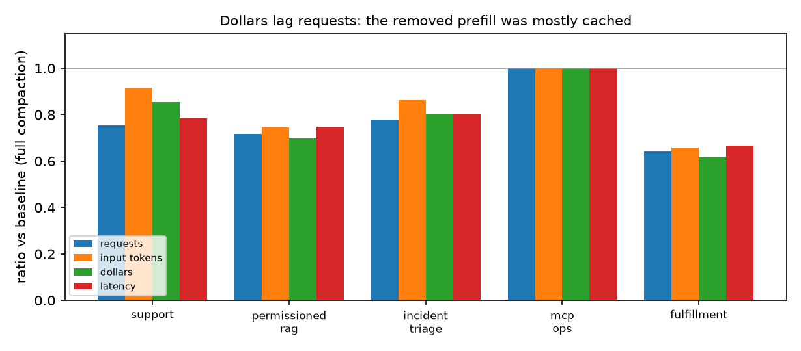
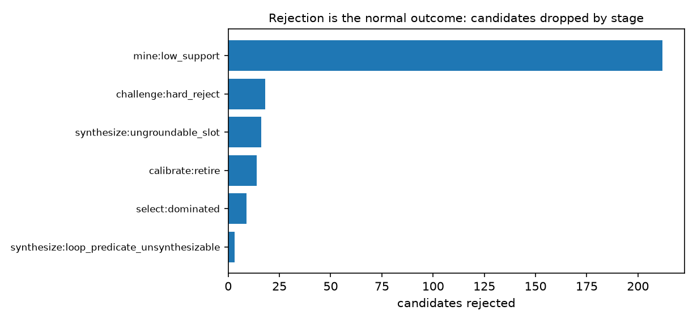

# Guarded Agentic Compaction — measured results

**Run manifest.** substrate=simulated, created=2026-08-02T21:41:43, python=3.14.4, platform=macOS-26.5.2-arm64-arm-64bit-Mach-O, numpy=2.5.1, scipy=1.18.0, sklearn=1.9.0, seed=20260801, n_episodes=0, quick=False, demos=['support', 'permissioned_rag', 'incident_triage', 'mcp_ops', 'fulfillment']

> every number produced here is measured on a simulated workload; it is not a provider or production measurement

## Scope

> **Offline stress study, not the primary demo evidence.** The user-facing demonstrations run through the live OpenAI Agents SDK; see [live-results.md](live-results.md) and the illustrated [HTML report](agent-compaction-report.html). This document retains the larger deterministic fixture study because it exercises calibration, perturbation, grouped uncertainty, and rare failure paths at a scale that is costly and non-reproducible through a provider API. Its numbers must not be presented as provider measurements.

This run covers 5 demonstration(s): `support`, `permissioned_rag`, `incident_triage`, `mcp_ops`, `fulfillment`.

## How to read this

* **The substrate is simulated.** A deterministic tool world plus a scripted policy stands in for the model at each request boundary. Everything downstream of the trace envelope — provenance, mining, synthesis, contracts, calibration, dispatch, statistics — is the real implementation running on real traces of that workload. No number here is a provider or production measurement.
* **The estimator ceiling covers GRC only.** Eq. (10) is `φρk / n_B` over compiled read-only *regions*. Request savings from route specialisation (TGWS removing a coordinator turn) are not in it, which is why Demo C reports `feasible=no` at a 6.1% region ceiling and still measures an 18% request reduction. Read the ceiling as a bound on the compiler, not on the system.
* **The hand-written comparator is the honest baseline.** Where condition 2 beats condition 3, the correct engineering answer is to write the function and skip the compiler (proposal §6.6). That happens here on 3 of 5 demonstrations.
* **Safety endpoints are counts with exact bounds, never averages.** A zero observed rate is reported as an upper bound. `artifact writes` is the hard gate: the compiled region performing an effect the baseline did not. `safety events` is the host agent's own downstream behaviour, reported with its mechanism because making evidence gathering deterministic can change how often a later write fires.

## H4 (ablation): status and why

**H4 is not demonstrated on the sealed test.** Zero unsafe dispatches were observed in both conditions, so the two upper bounds differ only through their denominators. The mechanism is worth stating: the simulated tools are deterministic and total, so a memorising or ambiguous binding still returns a *valid* record on in-distribution entities. The difference the ablation is meant to expose appears under distribution shift — reordered records, unseen entities, emptied collections — which is precisely what the perturbation suite injects and what the ablation never ran. The measurable difference here is therefore in *evidence coverage*, not in observed harm: the full system's artifacts carry a passed perturbation suite; the ablation's carry none. Scoring H4 properly needs the ablation run against the perturbation suite (or a shifted test split), not against the retrospective test split.

Where the ablation *does* differ measurably: on the negative control it dispatches (R_req 0.836) where the full system correctly refuses to emit an artifact at all (R_req 1.000), and on the RAG demonstration it reaches a worse ratio (0.816 vs 0.718) because unfiltered provenance produced narrower regions. Neither is a safety result.

| demo | φ full | φ ablation | R_req full | R_req ablation | unsafe UB full | unsafe UB ablation | ablation quality Δ |
|:---|---:|---:|:---|:---|:---|:---|:---|
| support | 0.9193 | 0.9193 | 0.755 [0.749, 0.762] | 0.755 [0.749, 0.762] | 0.0045 (0/661) | 0.0045 (0/661) | 0.000 [0.000, 0.000] |
| permissioned_rag | 1 | 1 | 0.718 [0.716, 0.721] | 0.725 [0.722, 0.727] | 0.0021 (0/1397) | 0.0021 (0/1397) | 0.000 [0.000, 0.000] |
| incident_triage | 1 | 0 | 0.780 [0.773, 0.787] | 1.000 [1.000, 1.000] | 0.0045 (0/658) | n/a (no dispatch) | 0.000 [0.000, 0.000] |
| mcp_ops | 0 | 0.9287 | 1.000 [1.000, 1.000] | 0.836 [0.829, 0.842] | n/a (no dispatch) | 0.0036 (0/833) | 0.000 [0.000, 0.000] |
| fulfillment | 1 | 1 | 0.642 [0.636, 0.646] | 0.549 [0.544, 0.555] | 0.0046 (0/653) | 0.0046 (0/653) | 0.000 [0.000, 0.000] |

## Headline: the co-primary endpoints

| demo | sealed-test episodes | groups | n_B | φ | R_req full [95% CI] | R_req hand-written | H3 <0.90 | H2 quality | co-primary |
|:---|---:|---:|---:|---:|:---|:---|:---|:---|:---|
| Demo A | 719 | 134 | 11.30 | 0.919 | 0.755 [0.749, 0.762] | 0.726 [0.721, 0.731] | PASS | PASS | PASS |
| Demo B | 1397 | 496 | 10.85 | 1.000 | 0.718 [0.716, 0.721] | 0.335 [0.332, 0.338] | PASS | PASS | PASS |
| Demo C | 658 | 515 | 10.43 | 1.000 | 0.780 [0.773, 0.787] | 0.922 [0.919, 0.925] | PASS | PASS | PASS |
| Demo D | 897 | 436 | 11.28 | 0.000 | 1.000 [1.000, 1.000] | 0.724 [0.721, 0.727] | fail | PASS | fail |
| Demo E | 653 | 196 | 8.84 | 1.000 | 0.642 [0.636, 0.646] | 0.661 [0.654, 0.668] | PASS | PASS | PASS |

## Feasibility, before any compiler ran

| demo | n_B | φ oracle | k | Δ ceiling | feasible | cal groups avail/req | break-even | blocked window mass |
|:---|---:|---:|---:|---:|:---|---:|---:|:---|
| support | 11.3 | 0.868 | 4.295 | 33.0% | yes | 118/92 | 72008/day | effect_unknown=0.723, live_in_not_in_entry_schema=0.133, effect_write=0.01, partial_run=0.008 |
| permissioned_rag | 10.85 | 0.448 | 6 | 24.8% | yes | 440/92 | 99913/day | partial_run=0.262, live_in_not_in_entry_schema=0.21, ambiguous_slot=0.091, effect_write=0.052 |
| incident_triage | 10.43 | 0.316 | 2 | 6.1% | no | 457/92 | 530278/day | barrier_event=0.596, effect_write=0.334, partial_run=0.011, ambiguous_slot=0.006 |
| mcp_ops | 11.28 | 0.67 | 2 | 11.9% | yes | 386/92 | 200392/day | effect_unknown=0.956, effect_write=0.005 |
| fulfillment | 8.845 | 1 | 3.655 | 41.3% | yes | 173/92 | 77130/day | live_in_not_in_entry_schema=0.357, effect_write=0.28, effect_unknown=0.082, partial_run=0.053 |

## Efficiency by condition

| demo | condition | requests | tool calls | input tok | cached tok | output tok | $/episode | p50 ms | p95 ms | surface tok |
|:---|:---|---:|---:|---:|---:|---:|---:|---:|---:|---:|
| support | 1 baseline | 11.24 | 7.52 | 1.468e+04 | 2.434e+04 | 779.5 | 0.02918 | 6264 | 7357 | 2640 |
| support | 2 hand-written macro | 8.16 | 4.405 | 8854 | 1.824e+04 | 566.5 | 0.01901 | 4566 | 5521 | 2830 |
| support | 3 full compaction (TGWS+GRC) | 8.485 | 7.52 | 1.345e+04 | 1.779e+04 | 588.9 | 0.02493 | 4850 | 5986 | 2640 |
| support | 4 support-only ablation | 8.485 | 7.52 | 1.345e+04 | 1.779e+04 | 588.9 | 0.02493 | 4850 | 5985 | 2640 |
| permissioned_rag | 1 baseline | 10.89 | 8.476 | 1.443e+04 | 2.199e+04 | 755.6 | 0.02834 | 5882 | 7324 | 2470 |
| permissioned_rag | 2 hand-written macro | 3.65 | 1.233 | 3956 | 6368 | 252.8 | 0.00827 | 1926 | 2689 | 2670 |
| permissioned_rag | 3 full compaction (TGWS+GRC) | 7.823 | 8.406 | 1.075e+04 | 7001 | 542.4 | 0.01974 | 4410 | 5739 | 1140 |
| permissioned_rag | 4 support-only ablation | 7.893 | 8.476 | 1.315e+04 | 1.532e+04 | 547.3 | 0.02382 | 4453 | 5824 | 2470 |
| incident_triage | 1 baseline | 10.5 | 5.292 | 9485 | 2.205e+04 | 728.4 | 0.0219 | 5548 | 7066 | 2580 |
| incident_triage | 2 hand-written macro | 9.676 | 4.447 | 8649 | 2.171e+04 | 671.3 | 0.02024 | 5142 | 6880 | 2780 |
| incident_triage | 3 full compaction (TGWS+GRC) | 8.185 | 5.024 | 8190 | 1.314e+04 | 567 | 0.01755 | 4465 | 6010 | 1962 |
| incident_triage | 4 support-only ablation | 10.5 | 5.292 | 9485 | 2.205e+04 | 728.4 | 0.0219 | 5563 | 7086 | 2580 |
| mcp_ops | 1 baseline | 11.34 | 7.64 | 1.486e+04 | 2.457e+04 | 786.9 | 0.02951 | 6299 | 7459 | 2640 |
| mcp_ops | 2 hand-written macro | 8.212 | 4.468 | 8922 | 1.837e+04 | 571.1 | 0.01916 | 4579 | 5569 | 2830 |
| mcp_ops | 3 full compaction (TGWS+GRC) | 11.34 | 7.64 | 1.486e+04 | 2.457e+04 | 786.9 | 0.02951 | 6310 | 7471 | 2640 |
| mcp_ops | 4 support-only ablation | 9.482 | 7.637 | 1.42e+04 | 2.015e+04 | 658.4 | 0.02685 | 5402 | 6630 | 2640 |
| fulfillment | 1 baseline | 8.877 | 6.047 | 1.068e+04 | 2.028e+04 | 615.9 | 0.02204 | 4573 | 5692 | 2860 |
| fulfillment | 2 hand-written macro | 5.864 | 3 | 6299 | 1.339e+04 | 408 | 0.01363 | 3029 | 3664 | 3060 |
| fulfillment | 3 full compaction (TGWS+GRC) | 5.695 | 5.926 | 7038 | 6508 | 395.2 | 0.01356 | 3070 | 4075 | 1540 |
| fulfillment | 4 support-only ablation | 4.877 | 6.047 | 8451 | 9981 | 339.4 | 0.0152 | 2672 | 3771 | 2860 |

## Quality and safety by condition

| demo | condition | task score | success | paired Δ [95% CI] | safety events | artifact writes | incidents | fallbacks | unsafe dispatch UB |
|:---|:---|---:|---:|:---|---:|---:|---:|---:|---:|
| support | 1 baseline | 0.9627 | 0.9708 | - | 44 | 0 | 0 | 0 | - |
| support | 2 hand-written macro | 0.9708 | 0.9708 | 0.008 [0.006, 0.011] | 47 | 0 | 0 | 0 | n/a (no dispatch) |
| support | 3 full compaction (TGWS+GRC) | 0.9627 | 0.9708 | 0.000 [0.000, 0.000] | 44 | 0 | 0 | 61 | 0.0045 (0/661) |
| support | 4 support-only ablation | 0.9627 | 0.9708 | 0.000 [0.000, 0.000] | 44 | 0 | 0 | 61 | 0.0045 (0/661) |
| permissioned_rag | 1 baseline | 0.9377 | 0.9377 | - | 0 | 0 | 0 | 0 | - |
| permissioned_rag | 2 hand-written macro | 0.9377 | 0.9377 | 0.000 [0.000, 0.000] | 0 | 0 | 0 | 0 | n/a (no dispatch) |
| permissioned_rag | 3 full compaction (TGWS+GRC) | 0.9377 | 0.9377 | 0.000 [0.000, 0.000] | 0 | 0 | 0 | 0 | 0.0021 (0/1397) |
| permissioned_rag | 4 support-only ablation | 0.9377 | 0.9377 | 0.000 [0.000, 0.000] | 0 | 0 | 0 | 0 | 0.0021 (0/1397) |
| incident_triage | 1 baseline | 0.9804 | 0.9346 | - | 0 | 0 | 0 | 0 | - |
| incident_triage | 2 hand-written macro | 0.9804 | 0.9346 | 0.000 [0.000, 0.000] | 0 | 0 | 0 | 0 | n/a (no dispatch) |
| incident_triage | 3 full compaction (TGWS+GRC) | 0.9904 | 0.9681 | 0.010 [0.006, 0.014] | 0 | 0 | 0 | 0 | 0.0045 (0/658) |
| incident_triage | 4 support-only ablation | 0.9804 | 0.9346 | 0.000 [0.000, 0.000] | 0 | 0 | 0 | 4251 | n/a (no dispatch) |
| mcp_ops | 1 baseline | 0.9699 | 0.9777 | - | 63 | 0 | 0 | 0 | - |
| mcp_ops | 2 hand-written macro | 0.9777 | 0.9777 | 0.008 [0.006, 0.010] | 64 | 0 | 0 | 0 | n/a (no dispatch) |
| mcp_ops | 3 full compaction (TGWS+GRC) | 0.9699 | 0.9777 | 0.000 [0.000, 0.000] | 63 | 0 | 0 | 0 | n/a (no dispatch) |
| mcp_ops | 4 support-only ablation | 0.9699 | 0.9777 | 0.000 [0.000, 0.000] | 63 | 0 | 0 | 0 | 0.0036 (0/833) |
| fulfillment | 1 baseline | 0.9951 | 1 | - | 0 | 0 | 0 | 0 | - |
| fulfillment | 2 hand-written macro | 1 | 1 | 0.005 [0.003, 0.007] | 0 | 0 | 0 | 0 | n/a (no dispatch) |
| fulfillment | 3 full compaction (TGWS+GRC) | 0.9969 | 1 | 0.002 [0.001, 0.003] | 0 | 0 | 0 | 0 | 0.0046 (0/653) |
| fulfillment | 4 support-only ablation | 0.9951 | 1 | 0.000 [0.000, 0.000] | 0 | 0 | 0 | 0 | 0.0046 (0/653) |

## Artifacts, rejections, maintenance surface

| demo | GRC artifacts | GRC rejections by stage | TGWS artifacts | TGWS rejections by stage | maintenance surface |
|:---|---:|:---|---:|:---|:---|
| support | 1 | synthesize:loop_predicate_unsynthesizable=1, select:dominated=3 | 0 | calibrate:retire=1 | active_artifacts=1, grc_artifacts=1, tgws_leaves=0, dsl_nodes=27 |
| permissioned_rag | 4 | mine:low_support=212, challenge:hard_reject=15, synthesize:ungroundable_slot=16, select:dominated=5 | 4 |  | active_artifacts=8, grc_artifacts=4, tgws_leaves=4, dsl_nodes=61 |
| incident_triage | 2 | calibrate:retire=4 | 1 | calibrate:retire=3 | active_artifacts=3, grc_artifacts=2, tgws_leaves=1, dsl_nodes=26 |
| mcp_ops | 0 | calibrate:retire=7 | 0 | calibrate:retire=2, route:low_purity=2 | active_artifacts=0, grc_artifacts=0, tgws_leaves=0, dsl_nodes=0 |
| fulfillment | 1 | synthesize:loop_predicate_unsynthesizable=2, calibrate:retire=3, challenge:hard_reject=3, select:dominated=1 | 1 |  | active_artifacts=2, grc_artifacts=1, tgws_leaves=1, dsl_nodes=20 |

## Figures







## Per demonstration

### Demo A — Tier-1 support evidence gathering

* `n_B` = 11.30 model requests/episode; splits train=186, dev=106, calibration=106, test=134, shadow=59 (split digest `bc0bcfcf334255d5`)
* estimator ceiling Δ_max = 33.0% (φ_oracle=0.868, k=4.295), feasible=True
* GRC: 1 artifact(s); rejections {'synthesize:loop_predicate_unsynthesizable': 1, 'select:dominated': 3}
* TGWS: 0 artifact(s); rejections {'calibrate:retire': 1}
* sealed test: R_req = 0.755 [0.749, 0.762], quality Δ = 0.000 [0.000, 0.000], φ = 0.9193, ρ = 0.9155
* co-primary (H2 ∧ H3): **PASS**

Prospective shadow (336 episodes, 59 groups): 3848 boundaries scored, nothing executed. Reported separately; never pooled into the sealed-test claim.

```text
artifact  issue_service_token.find_customer.region@br-aa03d@1   support 174/186 groups   removes k=4.03   [active]
──────────────────────────────────────────────────────────────────────────────
guard   effect_catalog_version=tier1-support@1#25016c220194af72  entry_contract_version=form_v3  guardrail_hash=#0001  model=sim-gpt-5-2026-04-12  policy_hash=#8d31  prompt_hash=#c47b  tools_hash=#19ae
        policy_version = 'pol-1'   (isolation key)
        principal = 'svc.support.tier1'   (isolation key)
        tenant_partition = 't_northwind'   (isolation key)
        z.ticket.requester_email : str matches ^[a-zA-Z0-9\-\.@]{33,42}$ (len 33..42)
        z.ticket.intake : str ∈ {form_v3}
        effects ⊆ {READ_EXTERNAL}  all speculatable ∧ replayable

program (θ = {ticket.requester_email}):
   serv = call auth.issue_service_token()
   cust = call crm.find_customer(email = z.ticket.requester_email |> lower, tenant = Const('t_northwind'), token = serv.token)
   subs = call crm.get_subscription(customer_id = cust |> filter(status == 'active') |> project('id'), token = serv.token)
   return  { cust: cust, serv: serv, subs: subs }
verify  serv : dict, non-null, provenance ∈ {auth.issue_service_token}
        serv.expires_in : int, non-null, ∈ [900.0, 900.0], provenance ∈ {auth.issue_service_token}
        serv.scope : str, non-null, ∈ {support.read}, provenance ∈ {auth.issue_service_token}
        serv.token : str, non-null, matches ^svc_[a-z0-9]{8,8}$ (len 12..12), provenance ∈ {auth.issue_service_token}
        cust : list, non-null, len ≤ 2, len ≥ 1, provenance ∈ {crm.find_customer}
        subs : dict, non-null, provenance ∈ {crm.get_subscription}
        subs.customer_id : str, non-null, matches ^cus_[A-Z0-9]{6,6}$ (len 10..10), provenance ∈ {crm.get_subscription}
        subs.plan_id : str, non-null, ∈ {plan_bus_60, plan_ent_240, plan_fre_1, plan_tea_12}, provenance ∈ {crm.get_subscription}
        subs.renews_on : str, non-null, ∈ {2027-02-01}, provenance ∈ {crm.get_subscription}
        subs.seats : int, non-null, ∈ [1.0, 240.0], provenance ∈ {crm.get_subscription}
        effect_multiset ⊆ {READ_EXTERNAL},  |calls| ∈ {3, 4, 5},  no WRITE_*
gate    q = logistic(entry features)   η = 0.50   (cal n=98 groups, α=0.05, δ=0.1, |Λ|=11, R⁺=0.047, φ̂=0.99)
```

### Demo B — permissioned RAG knowledge assistant

* `n_B` = 10.85 model requests/episode; splits train=694, dev=396, calibration=396, test=496, shadow=220 (split digest `54a50199e84a1f83`)
* estimator ceiling Δ_max = 24.8% (φ_oracle=0.448, k=6.0), feasible=True
* GRC: 4 artifact(s); rejections {'mine:low_support': 212, 'challenge:hard_reject': 15, 'synthesize:ungroundable_slot': 16, 'select:dominated': 5}
* TGWS: 4 artifact(s); rejections {}
* sealed test: R_req = 0.718 [0.716, 0.721], quality Δ = 0.000 [0.000, 0.000], φ = 1.0, ρ = 1.0
* co-primary (H2 ∧ H3): **PASS**

Prospective shadow (582 episodes, 220 groups): 6350 boundaries scored, nothing executed. Reported separately; never pooled into the sealed-test claim.

```text
artifact  route.acl.check_scope|index.versio@1   support 168/168 groups   removes k=0.07   [active]
──────────────────────────────────────────────────────────────────────────────
guard   effect_catalog_version=kb-rag@1#24aecfe15a4a26f8  entry_contract_version=q_v2  guardrail_hash=#0002  model=sim-gpt-5-2026-04-12  policy_hash=#5511  prompt_hash=#7ab1  tools_hash=#33cd
        policy_version = 'pol-1'   (isolation key)
        principal = 'role.engineering'   (isolation key)
        tenant_partition = 'acme'   (isolation key)
        effects ⊆ {}  all speculatable ∧ replayable
route  if true
       → agent=kb-assistant model=sim-gpt-5-2026-04-12 reasoning=default
       prompt_blocks=['citation_policy', 'acl_rules']
       tools=['acl.check_scope', 'index.version', 'search.retrieve', 'search.rerank', 'docs.fetch_metadata', 'docs.fetch_body'] handoffs=[]
       support=429 purity=0.94 tokens 2470→1140
gate    q = logistic(entry features)   η = 0.50   (cal n=108 groups, α=0.05, δ=0.1, |Λ|=11, R⁺=0.043, φ̂=1.00)
```

### Demo C — multi-agent incident triage

* `n_B` = 10.43 model requests/episode; splits train=720, dev=411, calibration=411, test=515, shadow=229 (split digest `b73a6d0df03025c0`)
* estimator ceiling Δ_max = 6.1% (φ_oracle=0.316, k=2.0), feasible=False
* GRC: 2 artifact(s); rejections {'calibrate:retire': 4}
* TGWS: 1 artifact(s); rejections {'calibrate:retire': 3}
* sealed test: R_req = 0.780 [0.773, 0.787], quality Δ = 0.010 [0.006, 0.014], φ = 1.0, ρ = 1.0
* co-primary (H2 ∧ H3): **PASS**

Prospective shadow (307 episodes, 229 groups): 3194 boundaries scored, nothing executed. Reported separately; never pooled into the sealed-test claim.

```text
artifact  route.runbook_specialist@1   support 285/720 groups   removes k=0.03   [active]
──────────────────────────────────────────────────────────────────────────────
guard   effect_catalog_version=triage@1#3af13be7e0e98128  entry_contract_version=alert_v5  guardrail_hash=#0003  model=sim-gpt-5-2026-04-12  policy_hash=#2f0c  prompt_hash=#91de  tools_hash=#77aa
        policy_version = 'pol-2'   (isolation key)
        principal = 'svc.oncall'   (isolation key)
        tenant_partition = 'platform'   (isolation key)
        z.alert_family : str ∈ {capacity, cert_expiry}
        effects ⊆ {}  all speculatable ∧ replayable
route  if z.alert_family != 'latency_spike' ∧ z.alert_family != 'deploy_regression' ∧ z.alert_family != 'error_rate'
       → agent=coordinator model=sim-gpt-5-2026-04-12 reasoning=default
       prompt_blocks=['coordinator_role', 'approval_policy']
       tools=['metrics.query', 'runbooks.lookup', 'approvals.request', 'remediation.execute', 'case.add_note'] handoffs=[]
       support=371 purity=0.95 tokens 2580→1090
gate    q = logistic(entry features)   η = 0.50   (cal n=158 groups, α=0.05, δ=0.1, |Λ|=11, R⁺=0.029, φ̂=1.00)
```

### Demo D — multi-tenant MCP operations (negative control)

* `n_B` = 11.28 model requests/episode; splits train=609, dev=348, calibration=348, test=436, shadow=193 (split digest `25c7a8fb3e5724e2`)
* estimator ceiling Δ_max = 11.9% (φ_oracle=0.67, k=2.0), feasible=True
* GRC: 0 artifact(s); rejections {'calibrate:retire': 7}
* TGWS: 0 artifact(s); rejections {'calibrate:retire': 2, 'route:low_purity': 2}
* sealed test: R_req = 1.000 [1.000, 1.000], quality Δ = 0.000 [0.000, 0.000], φ = 0.0, ρ = 0.0
* co-primary (H2 ∧ H3): **FAIL**

Prospective shadow (380 episodes, 193 groups): 4204 boundaries scored, nothing executed. Reported separately; never pooled into the sealed-test claim.

### Demo E — order-fulfillment exception handling

* `n_B` = 8.84 model requests/episode; splits train=274, dev=156, calibration=156, test=196, shadow=87 (split digest `f98097be1511b4dd`)
* estimator ceiling Δ_max = 41.3% (φ_oracle=1.0, k=3.655), feasible=True
* GRC: 1 artifact(s); rejections {'synthesize:loop_predicate_unsynthesizable': 2, 'calibrate:retire': 3, 'challenge:hard_reject': 3, 'select:dominated': 1}
* TGWS: 1 artifact(s); rejections {}
* sealed test: R_req = 0.642 [0.636, 0.646], quality Δ = 0.002 [0.001, 0.003], φ = 1.0, ρ = 1.0
* co-primary (H2 ∧ H3): **PASS**

Prospective shadow (308 episodes, 87 groups): 2720 boundaries scored, nothing executed. Reported separately; never pooled into the sealed-test claim.

```text
artifact  route.auth.issue_ops_token|orders.@1   support 274/274 groups   removes k=0.19   [active]
──────────────────────────────────────────────────────────────────────────────
guard   effect_catalog_version=fulfillment@1#d3cbb5a265074ec4  entry_contract_version=wms_v2  guardrail_hash=#0001  model=sim-gpt-5-2026-04-12  policy_hash=#b904  prompt_hash=#f10a  tools_hash=#3c72
        policy_version = 'pol-e1'   (isolation key)
        principal = 'svc.fulfillment.ops'   (isolation key)
        tenant_partition = 't_northwind'   (isolation key)
        effects ⊆ {}  all speculatable ∧ replayable
route  if true
       → agent=fulfillment-ops model=sim-gpt-5-2026-04-12 reasoning=default
       prompt_blocks=['role_fulfillment_ops', 'evidence_policy', 'commitment_policy']
       tools=['auth.issue_ops_token', 'inventory.check', 'carrier.track', 'sla.policy', 'orders.reschedule', 'case.escalate', 'refunds.issue_credit'] handoffs=[]
       support=963 purity=1.00 tokens 2860→1540
gate    q = logistic(entry features)   η = 0.50   (cal n=147 groups, α=0.05, δ=0.1, |Λ|=11, R⁺=0.031, φ̂=1.00)
```

