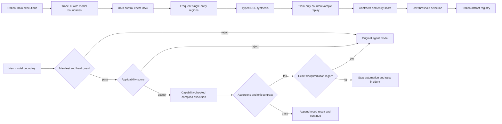
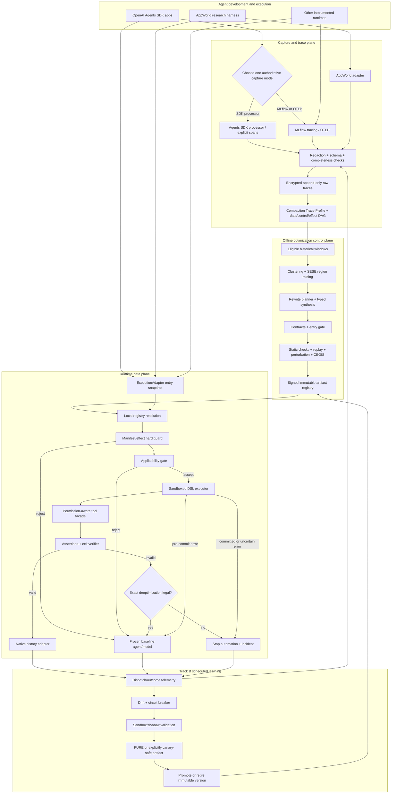

# Guarded Agentic Compaction

## Held-Out Trace-to-Program Specialization for Dynamic LLM Agents

**Feasible paper proposal — 1 August 2026**

> **Archived v1 design:** MLflow was evaluated here as a reference observability plane but
> was removed from release 0.6.0 after code-usage analysis found no maintained consumer.
> Current capture uses the OpenAI Agents SDK adapter and canonical local JSONL. See the
> [removal review](../docs/mlflow-removal-report.md). All MLflow passages below are
> historical proposal context, not current installation or reproduction steps.

## Feasibility verdict

The original idea is compelling, but the broad claim—agents should learn to compile repeated behavior into deterministic programs—is already occupied by a fast-moving literature. [Agent Workflow Optimization (AWO)](https://arxiv.org/abs/2601.22037) mines recurring tool sequences into deterministic meta-tools. [EvoC2F](https://openreview.net/forum?id=ZSGB91kMOG) combines a compiler IR, effect annotations, contract checks, regression tests, and verification-gated trajectory-to-function evolution. [MiniCache](https://arxiv.org/abs/2607.20507) converts recurring programs into parameterized executable cache objects with semantic variable extraction, validation, and fallback; [Agentic Plan Caching](https://proceedings.neurips.cc/paper_files/paper/2025/hash/9549f7d06700f0966d5f938f1d11022a-Abstract-Conference.html) reuses plans from completed executions. Programmatic-skill systems already induce executable functions from experience, and program-synthesis work predates LLM agents entirely.

A paper is still feasible if it makes a narrower, falsifiable contribution:

> Discover observation-dependent subregions across traces of an ordinary dynamic agent; synthesize bounded programs for those regions; and learn when to invoke or reject them, with all choices frozen before evaluation on held-out task scenarios.

The novelty must rest on the full conjunction of **cross-execution discovery of recurring single-entry/single-exit regions in raw stateful traces, regions spanning multiple genuine model decisions, effect-constrained observation-dependent synthesis, a Dev-frozen entry-state gate, and scenario-held-out end-to-end evaluation**, not on subtrajectory discovery, parameterized program caching, plan reuse, variable extraction, typed IRs, executable skills, contracts, verification, fallback, or workflow compilation individually.

| Formulation | Novelty | Feasibility | Decision |
|---|---:|---:|---|
| General agent that safely compiles itself online | Low and crowded | Low | Long-term motivation only |
| Repeated call sequences become composite tools | Already demonstrated | High | Baseline, not contribution |
| Semantic equivalence between an arbitrary agent and a synthesized program | Not defensible in general | Low | Do not claim |
| Cross-trace discovery and bounded synthesis of guarded subregions, evaluated on unseen scenarios | Plausibly differentiated | Medium–high | Proposed paper |

The first implementation should be deliberately conservative: compile **pure computation and mechanically verified snapshot-deterministic or replayable speculative reads** in a stateful API environment. “Read-only” and idempotent labels alone are insufficient because calls can still consume budget, alter audit state, observe time-varying data, or mutate state. Transactional mutation, unrestricted generated Python, and continuous self-rewriting are follow-on work.

## Abstract

Tool-using LLM agents repeatedly call a model to select APIs, bind arguments, interpret results, and decide what to do next. This flexibility is useful in unfamiliar states but expensive when many executions contain the same structured computation. We propose **Guarded Agentic Compaction**, an offline compiler that analyzes successful and failed agent traces, recovers data and control dependencies, and synthesizes bounded typed programs for recurring subregions. Each artifact has explicit entry conditions, version constraints, executable assertions, an exit contract, and an entry-only applicability score. Before each model request, a runtime may execute an applicable artifact and return its native tool-result trace to the unchanged agent; otherwise it invokes the original model. The main study admits only pure operations and mechanically verified snapshot-deterministic or replayable speculative reads, stages synthetic history until verification, and permits baseline deoptimization only while all declared state remains identical; a post-commit failure stops rather than pretending rollback. A separate reference architecture maps OpenAI Agents SDK execution and MLflow/OpenTelemetry spans into a versioned compaction trace profile; it is an engineering design, not part of the main empirical claim. We evaluate automatic synthesis, held-out task success, coverage, false dispatch, LLM decisions eliminated, latency, and amortized cost in a modified, non-leaderboard AppWorld protocol with scenario-grouped Train, Dev, Test Normal, and Test Challenge separation. The co-primary tests are task-success non-inferiority and a 20% reduction in deployable runtime cost. The paper does not claim general semantic equivalence, production safety, cross-domain generalization, or autonomous online self-modification. Its intended result is an empirical boundary: which parts of a dynamic agent are actually compilable, how that fraction changes with experience, and when selective specialization pays for itself.

## 1. Proposed claim

### 1.1 Thesis

For recurring, typed API workflows, a compiler can recover nontrivial, capability-checked speculative subworkflows from traces of a frozen dynamic agent. Programs that pass train-derived contracts and a Dev-calibrated applicability gate can replace multiple model decisions on unseen task scenarios, lowering runtime cost while preserving end-to-end task quality within a prespecified margin.

“Preserving behavior” means satisfying a declared observable contract and maintaining benchmark task success on held-out scenarios. It does not mean semantic equivalence for all possible inputs.

### 1.2 Research questions

- **RQ1 — Opportunity:** How many recurring regions cross actual model-request boundaries, rather than merely containing several tool calls in one model response?
- **RQ2 — Synthesis:** Can automatic synthesis recover data transformations or observation-dependent branches that generalize to unseen entities and values?
- **RQ3 — Selection:** Does an entry-only applicability gate reduce false dispatch relative to support-only routing or unconditional skill invocation?
- **RQ4 — Systems value:** How much runtime model cost and latency is saved after including gate, executor, validation, and failed-attempt overhead?
- **RQ5 — Experience:** Does useful compiled coverage increase as the compiler receives one, two, three, and five rollouts per Train task?
- **RQ6 — Shift:** On Test Challenge, does coverage fall gracefully when unseen applications or task structures invalidate learned assumptions?

### 1.3 Preregistered hypotheses

- **H1:** The system automatically synthesizes at least three nontrivial artifacts that each execute on at least five held-out Test Normal scenarios. A nontrivial artifact eliminates at least two distinct model requests and performs a learned transformation or branch; login-only prefixes and literal call concatenation do not count.
- **H2:** On Test Normal, the lower one-sided 95% confidence limit for the difference in Task Goal Completion between Guarded Agentic Compaction and the frozen agent exceeds \(-0.05\). A stricter \(-0.03\) margin is reported as a sensitivity analysis.
- **H3:** On Test Normal, the upper one-sided 95% confidence limit for the ratio of unconditional mean deployable runtime cost is below \(0.80\).
- **H4 (secondary):** On Test Normal, with both thresholds frozen on Dev, the learned entry-state gate has lower per-episode false-dispatch incidence than support-only routing, while its compiled coverage is no more than 5 percentage points lower.
- **H5 (exploratory):** In scenario-grouped Train cross-validation, compiled coverage and eliminated model requests increase from one to five rollouts per task without a rising out-of-fold contract-violation rate.

H2 and H3 are co-primary and both must pass. The 5-point non-inferiority margin is a substantive ceiling—at most one additional failure per twenty tasks—not a value to be changed to obtain power. A scenario-cluster simulation before development must determine whether AppWorld can estimate this margin with adequate power; if it cannot, the study is labeled estimation-focused rather than confirmatory before any Test execution.

## 2. Literature and contribution boundary

The search cutoff is **1 August 2026**. Many 2026 works are recent preprints or workshop papers; titles, results, and publication status must be rechecked immediately before submission.

### 2.1 Closest work

| Work | What it already covers | Remaining distinction |
|---|---|---|
| [AWO](https://arxiv.org/abs/2601.22037) | Mines repeated tool sequences into deterministic composite meta-tools; reports up to 11.9% fewer LLM calls and up to 4.2 percentage-point higher success | Mandatory straight-line baseline. The proposed method must discover data-dependent branches or transformations and validate them on separated scenarios |
| [EvoC2F](https://openreview.net/forum?id=ZSGB91kMOG) (ICML 2026) | Plan IR, dependency/effect semantics, idempotency, compiler optimization, contract/error tests, and verification-gated function evolution from successful trajectories | The narrow gap is raw cross-execution discovery of recurring observation-dependent subregions spanning several genuine model decisions in an ordinary unconstrained agent, followed by a Dev-frozen entry-state gate and stateful held-out evaluation. Typed IR/contracts are adopted machinery, not novel contributions |
| [Inducing Programmatic Skills for Agentic Tasks](https://openreview.net/forum?id=lsAY6fWsog) (COLM 2025), [WebXSkill](https://arxiv.org/abs/2604.13318), [SGDR](https://arxiv.org/abs/2606.04391), and [Neuro-Symbolic Skill Induction](https://arxiv.org/abs/2605.01293) | Induce, verify, retrieve, and execute programmatic skills or reusable subprocedures, including logic-grounded control flow and dynamic binding | Rule out claims that executable episode-derived skills, subtrajectory mining, state-grounded retrieval, or branching skill programs are new |
| [SkillOpt](https://openreview.net/forum?id=2ONrrPIFYi) (ACM CAIS Agent Skills 2026) | Verifier-guided compilation and regression optimization of an agent skill for repeated use in the same task/environment | The proposed method mines and synthesizes cross-task subregions and evaluates entry-state admission on unseen scenarios |
| [Skill Induction for Code Agents on Web Automation](https://openreview.net/forum?id=GmCoFYNEIU) (ACM CAIS Agent Skills 2026) | Verification-gated standalone Playwright functions with subsequent cross-task reuse on WebArena-Verified | Cross-task verified reuse is already occupied. The proposed distinction is dataflow/branch-aware cross-trace synthesis of regions spanning several model requests plus a Dev-frozen entry gate |
| [Agent Workflow Memory](https://proceedings.mlr.press/v267/wang25bx.html), [PANDO](https://arxiv.org/abs/2605.24785), [Executable Agentic Memory](https://arxiv.org/abs/2605.12294), [WALT](https://arxiv.org/abs/2510.01524), and [SkillWeaver](https://arxiv.org/abs/2504.07079) | Textual workflow induction, online skill distillation/demotion, executable state graphs, and learned deterministic web tools/APIs | Establish a crowded progressive-skill landscape. The contribution cannot be “agents become more efficient with experience” by itself |
| [Program Synthesis from Partial Traces](https://doi.org/10.1145/3729316) (PLDI 2025) and [WebRobot](https://arxiv.org/abs/2203.09993) (PLDI 2022) | Synthesize programs, transformations, branches, loops, and web automation from partial traces/demonstrations | Trace-to-program synthesis is not new. This paper adds agent-region discovery, train-derived contracts, selective deployment, and end-to-end agent evaluation |
| [MiniCache](https://arxiv.org/abs/2607.20507), [GenCache](https://papers.neurips.cc/paper_files/paper/2025/hash/07024f0479ae2f4981ed6cb3ebd81620-Abstract-Conference.html), and [Agentic Plan Caching](https://proceedings.neurips.cc/paper_files/paper/2025/hash/9549f7d06700f0966d5f938f1d11022a-Abstract-Conference.html) | Parameterize executable programs, synthesize variation-aware cached responses, or retrieve and adapt plans from completed executions; MiniCache already validates cache objects and falls back on failed binding | Program/plan caching, semantic variable extraction, validation, and fallback are not new. The residual question is whether raw stateful traces contain observation-dependent *subregions* crossing several actual model decisions that can be compiled under explicit effect contracts |
| [Compiled AI](https://arxiv.org/abs/2604.05150), [FlowCompile](https://arxiv.org/abs/2605.13647), [Agentic Compilation](https://arxiv.org/abs/2604.09718), and [COVENANT](https://arxiv.org/abs/2607.25400) | Compile specifications, structured workflows, one-shot plans, or natural-language procedures; some already include validation, fallback, bounded LLM escape hatches, and drift handling | Their source is a specification or predefined workflow rather than automatically discovered cross-trace regions. Validation/fallback/drift are not individually new |
| [Think Short, Defer Smart, Act, and Repeat](https://arxiv.org/abs/2607.26865), [Learn then Test](https://doi.org/10.1214/24-AOAS1998), and [Conformal Risk Control](https://openreview.net/forum?id=33XGfHLtZg) | Calibrate episode-level agent routing/deferral and predictive policies under declared sampling assumptions | Calibrated routing itself is not novel. This proposal combines empirical admission with learned compiled artifacts but does not claim a new statistical theorem |

The work also draws directly from process mining and runtime specialization. [Workflow mining](https://doi.org/10.1109/TKDE.2004.47), the [Inductive Miner](https://doi.org/10.1007/978-3-642-38697-8_17), and [local process models](https://arxiv.org/abs/1606.06066) motivate recurring-region discovery. [Partial evaluation](https://www.itu.dk/~sestoft/pebook/pebook.html), [Dynamo](https://doi.org/10.1145/349299.349303), and [TraceMonkey](https://doi.org/10.1145/1542476.1542528) motivate hot paths, guards, specialization, and deoptimization. These are technical antecedents, not just analogies.

### 2.2 Broader optimization taxonomy

| Line of work | Optimized object and timing | Why it does not subsume the proposed test |
|---|---|---|
| Workflow search: [AFlow](https://proceedings.iclr.cc/paper_files/paper/2025/hash/5492ecbce4439401798dcd2c90be94cd-Abstract-Conference.html) and [Automated Design of Agentic Systems](https://proceedings.iclr.cc/paper_files/paper/2025/hash/36b7acf6f6010652b3f2a433774a66fe-Abstract-Conference.html) | Searches prompts, operators, code, or whole workflow topology against a development objective | It designs a workflow rather than discovering recurrent effect-constrained subregions in executions of an otherwise frozen agent |
| Online scheduling: [LLMCompiler](https://proceedings.mlr.press/v235/kim24y.html), [LLM-Tool Compiler](https://arxiv.org/abs/2405.17438), and [Parrot](https://www.usenix.org/conference/osdi24/presentation/lin-chaofan) | Plans, parallelizes, fuses, or schedules calls for a current request or an application-declared dataflow graph | It does not learn reusable cross-execution regions; Parrot's semantic dataflow is supplied rather than inferred |
| Caching and executable memory: MiniCache, GenCache, Agentic Plan Caching, and programmatic skills | Reuses responses, plans, programs, or skills across related inputs | MiniCache and Agentic Plan Caching are mandatory main baselines; GenCache and a generic semantic cache are mechanism diagnostics. The proposed distinction cannot be “reuse executable computation”; it is raw multi-decision subregion discovery plus effect-aware synthesis and frozen admission |
| Corpus abstraction and graph rewriting: [LILO](https://proceedings.iclr.cc/paper_files/paper/2024/hash/819cebb05f993840e8a52d7564c5c282-Abstract-Conference.html), [Stitch](https://doi.org/10.1145/3571234), and [egg](https://doi.org/10.1145/3434304) | Learns reusable program-library abstractions or saturates an explicit IR with sound rewrites | Agent traces do not supply a sound equational theory; every rewrite still needs typed effect legality and translation validation |
| Hierarchical and learned control: the [options framework](https://doi.org/10.1016/S0004-3702(99)00052-1), [Agent Lightning](https://arxiv.org/abs/2508.03680), and learned agent policies | Learns initiation sets, temporal skills, model policies, or credit assignment from trajectories | It motivates entry/program/exit structure and future learned selection, but it normally changes a policy rather than emitting a bounded deterministic artifact with a replayable contract |
| Process mining and trace compression | Discovers frequent local behavior or compact process models from event logs | Frequency and a compact graph are hypotheses, not proof that a region can replace model decisions while preserving values, effects, and downstream history |
| JIT and partial evaluation | Specializes hot paths under guards and deoptimizes on mismatch | External tools, approvals, permissions, and irreversible effects make agent deoptimization materially harder than restoring machine state |

This taxonomy prevents a misleading “agent compiler” umbrella claim. The paper borrows optimization passes from several columns, but its evaluated contribution is a specific learn–validate–dispatch protocol.

### 2.3 Defensible contribution

The proposed contribution is the following conjunction:

> Cross-execution discovery of recurring single-entry/single-exit regions from raw executions of an otherwise unchanged agent; regions that span multiple genuine model decisions; bounded effect-constrained observation-dependent synthesis; a Dev-frozen entry-state gate; and scenario-held-out stateful evaluation of quality, coverage, and unconditional amortized systems cost.

The paper should avoid all unqualified priority language. It should not claim:

- the first agent compiler, deterministic meta-tool, or executable skill;
- the first program synthesized from traces;
- novelty for typed IRs, effect annotations, contracts, verification, or fallback individually;
- formal semantic equivalence;
- production-grade risk control; or
- safe continuous self-modification.

### 2.4 Falsifiable novelty test

If the learned artifacts are only authentication routines, fixed prefixes, or manually edited wrappers, the work collapses into an AWO-style replication. If programs are tested only on their source traces, the result is memorization. The paper is viable only if automatic synthesis recovers at least some transformations or branches that eliminate multiple model requests and execute on unseen scenarios.

## 3. Scope and assumptions

### 3.1 Main-paper scope

- Structured API agents with typed tool arguments/results and observable model-request boundaries.
- Connected, single-entry/single-exit regions containing two to eight tool events and crossing at least two model requests.
- Pure computation and mechanically verified snapshot-deterministic or replayable calls with explicit speculative capabilities, before any state/history/budget commitment.
- A restricted typed DSL; no unrestricted generated Python in the main condition.
- Offline compilation epochs and immutable artifact deployment.
- A deterministic controller conditional on tool results; external tools may remain nondeterministic.

### 3.2 Explicitly out of scope

- Hidden chain-of-thought collection or compilation.
- Arbitrary desktop/visual agents in the first paper.
- Compiling any state mutation in the main scored condition; idempotence by itself does not make fallback safe.
- Checkpoint-and-revert advantages unavailable to baseline agents.
- Unbounded loops or unrestricted synthesized code.
- General semantic equivalence or production safety certification.
- Online self-rewriting during the scored evaluation.

### 3.3 Preconditions

The compiler may emit an artifact only when:

1. support comes from distinct scenarios, not repeated loop iterations;
2. entry-visible state is sufficient to decide artifact eligibility; internal program branches depend only on observations produced by calls explicitly authorized as speculatable and replayable;
3. tool schemas, versions, permissions, and effect classes are recorded;
4. a deployable exit contract can be derived from Train data without hidden test graders;
5. every executed tool call has call-specific effect/capability evidence, and the region ends before the first environment, history, budget, audit, or other relevant commitment;
6. the artifact and gate are frozen before Test; and
7. the deployed baseline uses the same model, prompt, and tool interface that generated the mining traces.

When these conditions do not hold, **“do not compact” is the correct output**.

### 3.4 Two deliberately separate tracks

This proposal has two tracks whose evidence must not be mixed:

- **Track A — evaluated paper.** The 18-week AppWorld study uses offline compilation, immutable artifacts, pure or mechanically speculatable/replayable regions, a Dev-frozen gate, and held-out Test evaluation. H1–H5 and every headline quality/cost claim apply only to this track.
- **Track B — engineering reference architecture.** OpenAI Agents SDK and MLflow integrations support capture, analysis, a prototype runtime adapter, and scheduled immutable recompilation through quarantine, shadow validation, canarying, promotion, and retirement. Track B is not evidence of online behavior preservation, production safety, or generalization across the application patterns below.

The separation is central to feasibility. Track A asks one publishable empirical question with a frozen protocol. Track B shows how the idea could become an implementable platform without pretending that seven domains, online learning, and production hardening fit inside the same one-researcher experiment.

### 3.5 OpenAI Agents SDK as execution substrate

“Agentic SDK” in this proposal refers to the official [OpenAI Agents SDK](https://developers.openai.com/api/docs/guides/agents). It is the execution substrate and one trace source, not the compaction algorithm.

| SDK surface | What it exposes | Compaction use | Important boundary |
|---|---|---|---|
| [`Runner`](https://developers.openai.com/api/docs/guides/agents/running-agents) | A loop over model responses, tool calls, handoffs, approvals, streaming, and final output | Defines genuine model-decision boundaries and native run/result semantics | Application work outside the runner is invisible unless instrumented; lifecycle hooks observe but do not document a veto-and-replace return path |
| Agent definitions | Model, instructions, typed output, function/hosted/MCP tools, guardrails, handoffs, and local run context | Supplies agent/tool manifests and typed schemas | Dynamic instructions and local context can change behavior without appearing in ordinary model history; relevant projections must be recorded explicitly |
| Handoffs and agents-as-tools | Delegated ownership or manager-controlled nested specialists | Represents multi-agent control flow and nested regions | Handoffs are model-visible tools; compaction must preserve ownership, input filters, agent policy, and the final-answer owner |
| Function, hosted, MCP, shell, and application tools | Typed arguments/results plus tool-call IDs; local hooks surround function-tool execution | Supplies candidate operations and replay points | The SDK does not infer read/write effects, transactions, idempotency, quota consumption, or permission equivalence |
| Sessions and continuation | Application history, SDK sessions, `conversation_id`, or `previous_response_id` | Supports memory and resumed workflows | The SDK advises choosing one continuation strategy; mixed replay/server state can duplicate context, and server-managed state is not assumed rewritable |
| Guardrails and HITL approvals | Input/output/tool checks; `interruptions` plus serializable resumable state | Makes approval barriers and policy outcomes observable | Input guardrails cover only the first agent, output guardrails the final agent, and nested approval must still surface on the outer run; approval may never be optimized away |
| [Built-in tracing](https://openai.github.io/openai-agents-python/tracing/) | Run/task/turn, agent, generation/response, function, handoff, guardrail, MCP, and custom spans with IDs, nesting, timing, errors, and usage | Provides the operational skeleton for the canonical IR | It is a span tree, not a semantic dependency/effect graph. Sensitive model/tool payload capture is enabled by default, and OpenAI-hosted tracing is unavailable under ZDR |
| Trace processors and custom spans | `add_trace_processor()` adds a destination; `set_trace_processors()` replaces defaults | Enables a compaction-specific exporter and spans for gate, artifact, verifier, and fallback | Processor callbacks must be nonblocking and are version-coupled; replacing processors can silently remove the default exporter |

The SDK captures observable execution, not private reasoning. OpenAI exposes model outputs and optional reasoning summaries, but [does not expose raw chain-of-thought tokens](https://developers.openai.com/cookbook/examples/responses_api/reasoning_items#reasoning-summaries); encrypted reasoning items are opaque continuation state. The IR therefore uses `MODEL_REQUEST` and `MODEL_RESPONSE`, never a claimed reconstruction of hidden reasoning. A successful paper result would optimize observable decisions and tool/dataflow, not “compile thought.”

The SDK's strengths are an inspectable code-first loop, typed tool surfaces, explicit multi-agent ownership, resumable approvals, and extensible traces. Its relevant limitations are equally important: no effect system, no contract inference, no counterfactual replay, incomplete visibility into external state, and no documented mid-run artifact-dispatch plug-in. Those missing pieces are supplied by this proposal and tested separately.

### 3.6 MLflow Tracing as observability and evaluation plane

The reference implementation pins **MLflow 3.14.0**, the latest stable release in the [official archive](https://mlflow.org/releases/archive/) at the search cutoff, rather than relying on drifting `/latest/` behavior.

| MLflow capability | Intended use | Limitation that changes the design |
|---|---|---|
| [OpenAI Agents auto-tracing](https://mlflow.org/docs/latest/genai/tracing/integrations/listing/openai-agent/) via `mlflow.openai.autolog()` | Quick capture of multi-agent interactions, model calls, available/called function tools, inputs/outputs, and guardrails | No documented `openai-agents` compatibility range or guarantee of external-state capture; integration conformance is required |
| `TraceInfo` plus hierarchical `TraceData` spans | Queryable run metadata, inputs/outputs, timestamps, errors, attributes, links, and assessments | Request/response previews may be truncated; parent/child structure does not encode dataflow or effects |
| `@mlflow.trace`, `start_span`, events, links, and arbitrary span types | Instrument memory, retrieval, approval, environment state, and compaction runtime stages | Thread context is not propagated automatically; incorrect decorator/context wiring can fragment parallel traces |
| SQL-backed storage and `search_traces()` | Historical corpus selection, failure mining, version filtering, and audit | FileStore is deprecated/limited; high-level searches can be memory-heavy, so export must be paginated |
| Feedback, expectations, evaluation datasets, and `mlflow.genai.evaluate()` | Attach human, code, and LLM-judge assessments; construct frozen regression sets | Deterministic CODE scorers and environment tests—not LLM judges—are the correctness oracle for state/effect equivalence |
| Sampling, asynchronous logging, dashboards, and online judges | Production telemetry and qualitative issue detection | Sampling biases recurrence estimates; a full async queue or exhausted retry window can discard traces; online evaluation supports only judge-style scoring |
| [OpenTelemetry ingestion/export](https://mlflow.org/docs/latest/genai/tracing/opentelemetry/) and GenAI semantic conventions | Cross-service transport and optional dual export | Standard semantic conventions cover model/tool observability, not compaction contracts, effects, or replay semantics |
| Client-side redaction and self-hosting | Keep controlled traces inside project infrastructure | Redaction is custom and payload-specific; MLflow does not certify that secrets or identifiers were removed |

MLflow is therefore not the compiler IR. It is a transport, storage, search, annotation, and visualization plane beneath a versioned **Compaction Trace Profile**. Raw, complete trace JSON remains the evidence source; MLflow previews and dashboards are never used as canonical replay inputs.

There are two integration modes:

1. **Convenience mode:** `mlflow.openai.autolog()` for rapid development and UI inspection. The current MLflow implementation can clear existing Agents SDK trace processors under its default OpenAI-agent configuration, so coexistence with the SDK's exporter is not assumed.
2. **Authoritative research mode:** one designated Agents SDK processor or explicit manual/OTLP instrumentation emits the Compaction Trace Profile to an isolated SQL-backed MLflow server and immutable object storage. Only one component owns each source span tree. Source IDs, parent IDs, run/session IDs, and manifests are preserved, and a conformance job reconciles expected versus stored trace/span counts.

Benchmark runs use sampling ratio 1.0 and synchronous export, or explicitly flush asynchronous export before an episode is declared complete. Every run is followed by count/hash reconciliation and paginated JSON archival. The design does not claim that changing trace processors makes a deployment ZDR-compliant; that remains a separate provider and organizational policy decision.

### 3.7 Application-pattern feasibility matrix

These scenarios define the framework's intended applicability and instrumentation requirements. They are not seven evaluated domains and must not be cited as evidence of cross-domain generalization.

| Scenario | Trace evidence required | Plausible compactions | Hard preservation boundary |
|---|---|---|---|
| Multi-agent orchestration | Agent spans, handoffs, agents-as-tools, ownership transitions, context filters, agent manifests | Stable routing predicates, parallel read fan-out, bounded cross-agent read-only macros | Do not erase ownership, specialist policy, guardrails, context filtering, or nested approvals |
| Tool-heavy workflow | Typed calls/results, schemas, errors/retries, model-boundary IDs, resources and principals | Batching, fusion, deterministic binding, memoization, and elimination of intermediate model choices | Preserve effects, ordering, rate limits, billing, permissions, and error granularity |
| Long-running business process | Session/group/job IDs, pause/resume, timers, workflow and record versions | Deterministic read/validate state-machine segments and polling coalescence | Exactly-once writes, stale state, time drift, compensation, and version migrations remain outside Track A |
| Human-in-the-loop | Approval request/resolution, approver scope, policy hash, serialized run-state digest | Evidence preparation, deterministic validation, and queue routing before the approval | Approval is an immutable barrier; a prior or repeated approval never licenses bypass |
| Memory-enabled agent | Memory reads/writes, namespace, identity, snapshot/version, retention metadata | Versioned read caching, retrieval/deduplication, deterministic formatting | Memory writes, cross-user reuse, stale memory, and identity leakage reject compaction |
| Enterprise automation | MCP/function spans, tenant/principal, RBAC, policy, audit, residency, and credential scopes | Read-only macros, typed routing, batched lookups, policy-preserving preparation | Tenant isolation, consent, residency, credential boundaries, and auditability are hard constraints |
| RAG/knowledge workflow | Query, embedding/retrieval/reranking spans, document provenance, index/corpus/ACL versions | Query and result deduplication, embedding batches, deterministic filters, citation assembly | Freshness, ACL, source provenance, citation coverage, and index version enter the key and hard guard |

Memory operations, human decisions, retriever internals, index versions, and enterprise policy context require custom spans. Neither OpenAI Agents SDK nor MLflow should be assumed to infer them automatically.

## 4. Formalization

### 4.1 Canonical execution record

Let a frozen baseline agent \(B\) interact with environment \(E\). An observable execution is

\[
\tau_i=(x_0,e_1,\ldots,e_m,x_m,y_i,u_i,c_i),
\]

where every event records its model-request ID, typed tool input/output, data dependencies, schema and tool version, effect class, latency, and cost. \(u_i\) is benchmark utility and \(c_i\) is deployable runtime cost. Private reasoning is not logged.

The versioned Compaction Trace Profile is deliberately richer than either provider's span schema:

| Object | Required fields |
|---|---|
| `TraceEnvelope` | Schema version; internal and source trace IDs; source system; application/workflow; hashed session and scenario group; Train/Dev/Test/production split; sampling probability; execution manifest; events, edges, outcomes, and completeness flags |
| `ExecutionManifest` | SDK/runtime/compiler versions; agent-graph and instruction hashes; model IDs/settings; prompt hashes; tool names, schema hashes, transports, and versions; environment/data/index snapshots; permission/effect-policy hash; history/continuation strategy |
| `EventNode` | Event/parent/sequence IDs; run, agent, model request/response, tool call/result, handoff, guardrail, approval, memory, retrieval, or custom kind; agent/model/tool-call IDs; timestamps, status, retries, errors; typed input/output references; provenance; tokens, latency, and cost |
| `Edge` | Source, target, and `CONTAINS`, `DATA`, `CONTROL`, `HAPPENS_BEFORE`, `CONFLICT`, `APPROVAL`, or `SESSION` kind; optional field path and transformation provenance |
| `EntryState` | Observable model-boundary fields; agent/history digest; principal and tenant; policy/tool manifest; environment/data/index snapshot; budget, time, and freshness context; candidate feature version. Every field must be obtainable before dispatch |
| `EffectSpec` | `PURE`, `READ_LOCAL`, `READ_EXTERNAL`, `WRITE_REVERSIBLE`, `WRITE_IRREVERSIBLE`, or `UNKNOWN`; resource/principal scopes; idempotence, commutativity, transaction, quota/billing/audit, approval, and compensation metadata; separate `speculatable`, `retryable`, `replayable`, `cacheable`, `elidable`, `reorderable`, and `batchable` capabilities |
| `ExecutionRecord` | Entry/artifact IDs; candidate set; hard-guard vector; score and frozen threshold; executed calls/results; verifier outcome; reject/deoptimization/incident reason; state and history digests; latency, tokens, CPU, and cost |
| `OutcomeLabels` | Benchmark success, deployable contract results, effect deltas, feedback/expectation provenance, evaluator version, split, and compilation-visibility class |

Raw payloads are encrypted in append-only object storage. Mining uses redacted typed projections and salted tenant-scoped identifiers. `READ_EXTERNAL` is not automatically safe: a nominal read may consume quota, create audit state, reveal time-varying data, or depend on an ACL. Idempotence and read-only classification license no optimization by themselves; each transformation requires the corresponding call-specific capability.

The compiler receives a physically separated `CompilationTraceView`. General compilation workers can read only Train projections and labels. A narrowly scoped Dev-selection job can read Dev outcomes only while choosing the preregistered configuration and threshold. Test envelopes, taskwise outcomes, and evaluator credentials live in a sealed experiment inaccessible to compiler and development processes. This access separation, not a boolean “label available” field, enforces the evidence boundary.

Track A admits only snapshot-deterministic or replayable speculative calls that do not change evaluator-relevant environment, database, session/history, interaction budgets, wall-clock/RNG state, quota/billing, rate-limit, or audit state. Failed speculative work is still charged to latency and cost.

### 4.2 Artifact and admission semantics

A candidate region \(r\) has a single observable entry \(z\) and exit

\[
o_r=(v_r,\epsilon_r),
\]

where \(v_r\) is the structured value returned to the downstream agent and \(\epsilon_r\) is the allowed speculative effect trace. A compiled artifact is

\[
a_r=(P_r,H_r,q_r,V_r,M_r),
\]

with:

- \(P_r\): a typed deterministic program;
- \(H_r(z)\): a hard entry predicate;
- \(q_r(z)\): an entry-only nonconformity score;
- \(V_r\): inline assertions and a deployable exit-contract checker; and
- \(M_r\): immutable model, prompt, tool, schema, permission, and compiler versions.

The persisted `ArtifactManifest` also carries live-in/live-out schemas, allowed effects and required capabilities, evidence provenance, Train support, grouped-validation and Dev-selection digests, construction cost, expected savings, history-adapter and interpreter versions, gate-feature hash and frozen threshold, a signature, registry revision, and lifecycle state. Track A uses `DRAFT` and `VALIDATED` while building, then deploys only one signed frozen `ACTIVE` snapshot. `QUARANTINED`, `CANARY`, and `RETIRED` are Track B operational states.

At a model boundary, the runtime rejects to \(B\) if the manifest or hard guard fails, or if \(q_r(z)\) exceeds the Dev-selected threshold. Otherwise it executes \(P_r\). Before any model-visible or externally committed event, a failed speculative execution may deopt to \(B\) only if the adapter attests identical entry state and history. After an effect, history, budget, or synthetic response is committed, the runtime may not pretend rollback: it stops automated progression and records an incident unless an equally available tested transaction restores every relevant state component. If validation passes, a common history adapter serializes every synthesized assistant tool call and tool result in the agent harness's native message schema and skips the model requests covered by the region. Artifact IDs remain in non-model-visible telemetry; the main condition injects no novel natural-language summary.

The runtime verifier is not the benchmark grader. It may check schemas, value invariants, evidence provenance, effect allowlists, and postconditions learned from Train. Hidden task tests are used only for offline evaluation.

### 4.3 Evaluation quantities

Define episode-level dispatch and failure indicators:

\[
D_i(t)=\mathbb{1}[\text{at least one artifact is accepted in episode }i],
\]

\[
L_i(t)=\mathbb{1}[\text{any accepted dispatch violates its declared contract in episode }i].
\]

Then

\[
\phi(t)=\Pr[D_i(t)=1],\qquad
R(t)=\mathbb{E}[L_i(t)\mid D_i(t)=1].
\]

For the gate ablation, also define unconditional false-dispatch incidence \(F(t)=\mathbb{E}[L_i(t)]\). H4 requires lower \(F\) without buying the result through more than a 5-point loss of Test coverage; \(R\) and \(\phi\) are reported alongside it.

Coverage and risk are both defined at episode level; repeated dispatches within one episode are not treated as independent samples. AppWorld variants are further clustered by scenario in inference.

The Dev set is too small for a credible production-style finite-sample risk guarantee at useful coverage. The main paper therefore reports empirical calibration, confidence intervals, and the held-out Test risk–coverage point. Learn-then-Test may be reported only as an exploratory analysis if its independence and sample-size requirements are actually met; it is not a headline claim.

The compiler maximizes estimated net savings

\[
\mathbb{E}[C_B-C_A]-\frac{C_{\text{compile}}}{N}
\]

subject to Train/Dev contract constraints and minimum coverage. The empirical correctness claim is **held-out contract satisfaction**, never universal equivalence or a refinement theorem.

## 5. Method

### 5.1 Trace IR

Instrumentation records model-request/response boundaries, typed tool calls, tool results, structured state fingerprints, schema hashes, permissions, effect class, failures, retries, tokens, model time, tool time, and cost. Credentials and direct identifiers are redacted; volatile IDs are alpha-renamed while equality relationships are preserved.

Each trace is converted to an event DAG with:

- data edges when an earlier result supplies a later argument;
- control edges when an observation changes the path;
- model-boundary edges identifying a model invocation that could actually be removed; and
- conflict edges between noncommuting effects.

This prevents the common error of counting several tool calls emitted in one assistant turn as several saved LLM calls.

The source-to-IR mapping is explicit and versioned:

| Source record | Canonical node/edge | Required augmentation |
|---|---|---|
| Runner/trace/task/turn | `RUN` plus containment and model-boundary sequence | Application/workflow, split, scenario, continuation strategy, completeness counter |
| Agent span | `AGENT` | Agent graph, instruction/model/tool/policy hashes and ownership |
| Generation or response span | `MODEL_REQUEST` and `MODEL_RESPONSE` | Stable request ID, visible response items, usage, cost, retry, provider version; opaque reasoning remains opaque |
| Function/MCP/tool span | `TOOL_CALL` and `TOOL_RESULT` joined by call ID | Typed schema, principal, resource, effect spec, state-before/after digest, provenance, logical action versus RPC |
| Handoff or nested agent | `HANDOFF`, `AGENT`, and control/containment edges | From/to owner, input filter/history mapper, nested approval propagation |
| Guardrail or interruption | `GUARDRAIL`, `APPROVAL_REQUEST`, and `APPROVAL_RESOLUTION` | Policy/version, reviewer scope, decision, serialized-state digest; approvals need explicit custom instrumentation where absent |
| Session, memory, or retrieval | `SESSION`, `MEMORY_*`, or `RETRIEVAL` edges/nodes | Namespace, tenant, snapshot/index/ACL version, freshness and citation provenance |
| Compaction runtime span | `CUSTOM` decision/execution nodes | Candidate set, hard-guard vector, score/threshold, artifact/evidence digest, validation and fallback reason |

The normalizer never invents missing causality. Unknown producer fields, effects, or state versions remain `UNKNOWN`, which makes a candidate ineligible. Cross-service links are converted to `HAPPENS_BEFORE` or `DATA` only when a trace-context and field-provenance check succeeds.

### 5.2 Candidate discovery

Mine connected, single-entry/single-exit subgraphs containing two to eight tool events and at least two removable model requests. Support is the number of distinct Train scenarios. Arguments are anti-unified into typed parameters; constants remain explicit.

Rank candidate \(r\) by

\[
\text{scenario support}\times\text{expected model cost saved}
-\lambda_1\text{branch entropy}
-\lambda_2\text{effect risk}
-\lambda_3\text{synthesis complexity}.
\]

Low entropy is regularity, not correctness. Failed traces and rare branches are retained as negative evidence. Regions containing unsupported writes or hidden-state dependencies are rejected.

### 5.3 Contract induction

Infer and test:

- required entry fields and types;
- tool/schema versions and permissions;
- result cardinality/range predicates;
- state and user-consent preconditions;
- allowed calls, effect trace, and required speculative capabilities;
- output schema and provenance;
- postconditions sufficient for the downstream declared contract.

Full-task success does not prove each subtrace was necessary or correct. Train environments are replayed from their standard initial states to test whether a candidate is sufficient for its declared exit contract. The hidden Test evaluator never participates in contract construction or runtime validation.

### 5.4 Restricted synthesis

The main DSL includes:

- `Call`, `Let`, typed records, and explicit provenance;
- `Project`, `Filter`, `Map`, `Join`, `Sort`, `TopK`, and `Reduce`;
- typed `If` and finite-state transitions;
- bounded `ForEach`; and
- `Assert` and `ReturnEvidence`.

Recover the tool skeleton from traces, anti-unify argument bindings, and synthesize pure transformations and predicates with type-directed enumeration or SyGuS. [Syren](https://arxiv.org/abs/2504.14480) should be reused where compatible or included as a synthesis baseline.

Counterexample-guided refinement is Train-only:

1. synthesize a minimum-description-length candidate;
2. run it on held-out Train-scenario folds;
3. compare the deployable exit contract and allowed effect trace;
4. perturb entities, list size/order, nulls, duplicates, and tool failures;
5. add contract-breaking examples and resynthesize; and
6. reject on timeout, unsupported effect, or unresolved ambiguity.

No human may edit the emitted program in the main condition.

### 5.5 Applicability gate

The gate has two layers:

- **Hard guard:** exact manifest versions, required fields, permissions, effect allowlist, and known state predicates.
- **Learned score:** entry-only features such as distance from Train support, unseen enum/value patterns, branch ambiguity, program-ensemble disagreement, and out-of-fold replay failure.

Learn score parameters with scenario-grouped cross-validation on Train. Freeze the score, then select one threshold on Dev using a preregistered objective: maximize saved model cost subject to a minimum 20% episode coverage and an observed deployable contract-failure cap. Because Dev has only 20 scenario groups, this is empirical selection, not a distribution-free certificate. An LLM's verbal confidence is never used as the gate.

### 5.6 History adapter, runtime, and versioning

Entry detection runs through an `ExecutionAdapter` contract at a pre-model boundary. The modified AppWorld harness supplies the scored implementation. Every executable baseline and the proposed method uses the same adapter and history reconstruction; only region representation and selection differ. On success, the adapter reconstructs native assistant tool-call and tool-result messages, including their exact serialized token cost. The next baseline-model request therefore receives a valid native history rather than a compact summary. A summary-based context-compaction adapter is reported only as a separate ablation because it would introduce a second treatment.

Artifacts are immutable and carry trace hashes, DSL source, contracts, Train/Dev evidence, and model/prompt/tool/schema versions. A version mismatch rejects before execution. The main scored method does not use AppWorld checkpoint reversion. Its `ExecutionAdapter` stages synthetic history until verification and may deopt only after attesting that environment/database state, session and model-visible history, interaction budget, wall-clock/RNG projection, quota/billing/audit counters, and permission context equal the entry snapshot. A speculative attempt's latency and cost are never discarded from measurement.

Any mutation-capable extension must either use an environment-native transaction available equally to every condition or be reported separately as a modified systems experiment. Catching an exception after an irreversible write—or after committing synthetic SDK history—and calling the baseline is not safe fallback.

### 5.7 OpenAI Agents SDK runtime integration

Capture and execution integration have different maturity. Capture is supported directly; transparent mid-run substitution requires custom runtime work.

| Integration path | Documented status | Role in this project |
|---|---|---|
| Agents SDK tracing/processors, custom spans, and MLflow auto/manual tracing | Documented | Preferred capture-only integration, subject to the one-authoritative-tracer rule in Section 3.6 |
| `RunHooks` / `AgentHooks` | Documented observers around agents, model calls, tools, and handoffs | Telemetry and state fingerprinting only; `on_llm_start` does not return a replacement model response |
| `call_model_input_filter` | Documented transformation of prepared model input | Useful for the separate context-compaction ablation, but it cannot skip the call or execute a multi-turn artifact |
| Compiled `FunctionTool` or agent-as-tool | Documented | Strong macro baseline and first SDK demo; a model still has to select it, so the invocation call is not eliminated |
| Outer controller around `Runner.run` | Ordinary application composition | Safe prototype at run boundaries; it cannot compact arbitrary inner turns unless it owns the loop |
| Custom [`Model` / `ModelProvider`](https://openai.github.io/openai-agents-python/ref/models/interface/) wrapper | The extension interface is documented; compaction behavior is custom | Track B prototype can return a deterministic `ModelResponse` instead of calling the remote model on a hit, and delegate to the wrapped model on a miss |
| Forked/custom runner | Not a standard plug-in | Maximum control and maintenance risk; excluded from Track A |

The proposed Track B prototype is a `CompactingModel` wrapper plus a run-scoped `EntryStateProvider` owned by the outer application controller. The provider supplies the observable entry snapshot through concurrency-isolated context rather than assuming arbitrary application state is present in `Model.get_response()`. On an accepted artifact, the wrapper emits SDK-valid tool-call response items from the artifact state machine; the ordinary runner executes the tools and returns results. Subsequent model boundaries advance the artifact or delegate to the wrapped baseline model. This design can remove actual provider calls while retaining SDK tool dispatch, but it is not equivalent by construction and requires interleaved-run isolation tests.

Deoptimization has two distinct phases. Before the wrapper emits a synthetic `ModelResponse`, a miss, guard failure, timeout, or interpreter failure can delegate exactly to the wrapped model. After emission, the Runner may already have committed the response, tool call, result, or session history; the `Model` interface alone cannot erase that state. Exact post-call deoptimization therefore requires a tested staging owner in an outer controller, custom runner, or session transaction. Without it, a post-commit verifier failure stops automation and raises an incident rather than silently resuming the baseline.

The first prototype is non-streaming, uses application-managed history or one SDK session strategy, stays within one agent, and supports local function tools only. Handoffs, agents-as-tools, hosted tools, streamed responses, and server-managed `conversation_id` / `previous_response_id` continuation fail closed until separate fixtures pass. A standard compiled-tool implementation is retained as a baseline so the paper can distinguish “model selects a macro” from “runtime eliminates model decisions.”

The SDK adapter must pass all of the following before any claim of parity:

1. a no-op adapter produces byte-equivalent input at the next provider call;
2. accepted execution produces schema-valid SDK-native items satisfying the declared tool identity, typed arguments/results, ordering, ownership, effect, and continuation contracts;
3. deterministic reference replay of the same recorded entry and observations yields matching native items, history digest, exit value, and allowed effect trace; no claim requires a fresh stochastic baseline run to choose identical actions;
4. a rejected pre-emission or staged speculative attempt restores identical model-visible input and every declared state component; post-commit failure is classified separately;
5. usage, errors, retries, guardrails, approvals, and trace nesting remain attributable;
6. each supported history/session strategy and concurrent interleaving passes multi-turn continuation fixtures; and
7. unsupported streaming, hosted-tool, or handoff cases reject rather than silently degrade.

Custom runtime spans are emitted for `compaction.resolve`, `compaction.guard`, `compaction.gate`, `compaction.execute`, `compaction.verify`, `compaction.history`, `compaction.deopt`, and `compaction.incident`. Each records the artifact/version, decision reason, elapsed time, cost, reconstructed-history digest, and source event IDs. When trace-context propagation passes conformance, these spans share the MLflow trace with baseline work; otherwise explicit trace links correlate them and the limitation is reported.

### 5.8 Transformation and learning portfolio

The system is a pass framework, not one monolithic synthesizer. Hard effect, permission, approval, and contract constraints run before any learned objective.

| Pass | Transformation | Eligibility and validation | Paper status |
|---|---|---|---|
| Trace-pattern mining | Event DAGs → recurring typed single-entry/single-exit regions | Frequent connected-subgraph mining over distinct scenario groups; at least two true model boundaries; grouped replay | Track A core |
| Clustering and semantic deduplication | Alpha-renamed graph shapes → candidate families | Typed graph hash/edit distance first; embeddings may propose merges, but unioned contracts and regression suites must prove them | Core preprocessing / ablation |
| Tool fusion and batching | Compatible logical calls → one composite or batch RPC | Explicit batch contract; same principal, ACL, freshness, ordering, and error semantics; differential values/effects | Mandatory diagnostic; Track B optimization |
| LLM-call elimination | Model-selected bindings/branches → program operations | Every required live-out recoverable from entry state or allowed observations; grouped CEGIS and perturbation | Track A core |
| Deterministic rule extraction | Repeated decisions → typed `If`, finite-state transition, or decision table | Predicate expressible in the DSL; failures and rare branches retained as counterexamples | Track A core |
| Agent specialization | Broad agent region → bounded specialist or deterministic router | Separate manifest/policy/tool surface; preserve answer ownership and guardrail boundaries | SDK baseline / extension |
| Graph rewriting | Region → optimized artifact node | Dominance/postdominance, live-in/out, type, control, effect, and approval-barrier legality | Track A core |
| Reusable macro creation | Validated artifact → parameterized composite operation | Explicit entry/exit contract, immutable version, native history reconstruction | Track A core |
| Partial evaluation | Fix manifest constants and simplify predicates/data transforms | Exact prompt, model, tool, schema, permission, and environment versions; AST plus differential checks | Track A core |
| Common-subexpression elimination and exact memoization | Repeated pure/read operation → canonical keyed value | Principal, arguments, schema, state/index version, TTL, and provenance in key; no mutation or approval | Diagnostic / extension |
| Semantic caching | Similar request/read → reuse candidate | Similarity only retrieves; typed binding, hard versions, freshness, provenance, and exit validation decide | Baseline / extension, never a safety oracle |
| Hierarchical compression | Validated leaf artifacts → larger macros | Acyclic artifact dependency graph, bounded expansion depth, and flattened-program differential replay | Track B extension |
| Learned entry/selection policy | Entry features → artifact or baseline | Only already validated artifacts are actions; entry-only features; Dev-frozen threshold and deterministic tie-break | Gate is Track A; richer selector is future |
| Hybrid symbolic–LLM execution | Symbolic skeleton with a constrained LLM leaf | Explicit schema, budget, provenance, and separate cost; cannot be called deterministic | Future baseline/extension |
| Contextual bandit or RL policy | Choose among baseline and validated artifacts | Logged propensities or authorized exploration; immutable hard constraints; off-policy evaluation and canary | Track B research only |
| Multiobjective planner | Candidate set → Pareto-efficient deployment set | Safety/effect constraints are filters; then optimize quality, coverage, model calls, tokens, latency, cost, and reliability | Track A selection plus secondary frontier |

Candidate discovery is hierarchical. First normalize values and cluster by typed tool/agent/effect signature. Next mine frequent connected regions and compute dominator/postdominator single-entry/single-exit boundaries. Then anti-unify live-ins/live-outs and recover the data transformations and observation-dependent branches. Finally apply legal compiler passes—constant propagation; dead unused-read elimination only for `elidable` calls; common-subexpression elimination only for `cacheable` calls; independent-read parallelization only for `reorderable` calls; fusion/batching only for `batchable` calls with a matching API contract; and partial evaluation—before CEGIS.

Tool fusion must report **logical tool actions** separately from **physical RPCs**: batching five reads into one request is a transport win, not deletion of four semantic actions. Trace compression also has two meanings that must remain separate. A hierarchical summary may accelerate mining, but executable validation always links back to complete raw events; the system never treats a lossy narrative trace summary as proof of equivalence.

An LLM may propose a DSL skeleton, variable names, or candidate predicate. A symbolic type/effect checker, bounded interpreter, grouped replay, and executable contract determine admission. This hybrid proposal mechanism is compared with enumerative synthesis, but an LLM's confidence or critique never satisfies a hard gate.

### 5.9 End-to-end architecture

Track A uses the capture, offline optimization, registry, and runtime planes with a signed snapshot; only the scheduled-learning subgraph and registry updates are disabled throughout frozen Dev and Test. The trace path is asynchronous from the runtime decision path. A pre-dispatch registry outage, unknown effect, policy ambiguity, or optimizer error rejects to the baseline. A suspected failure after a state/history/effect commitment stops automation and raises an incident rather than pretending fallback is possible.

### 5.10 Offline historical and online adaptive algorithms

The offline compiler runs the following reproducible epoch:

1. pin agent, prompt, model, tool, policy, environment, and trace-schema manifests;
2. ingest complete unsampled historical traces and label success, failure, and evaluator provenance;
3. convert operational span trees to typed data/control/effect DAGs;
4. enumerate bounded recurring regions across scenario-grouped executions;
5. anti-unify values, cluster compatible graph shapes, and split ambiguous families;
6. plan legal rewrites and synthesize the minimum-description-length DSL artifact;
7. infer entry, effect, provenance, and exit contracts from Train only;
8. run static checks, held-out Train-group replay, perturbation, tool-failure injection, and counterexample-guided refinement;
9. train the entry-only score with grouped Train folds;
10. choose the configuration and threshold once on Dev; and
11. sign the artifact/evidence manifest and freeze it before Test.

Track B interprets “online adaptive” as **scheduled immutable compilation epochs**, not self-editing code in a live request:

1. observe both baseline and artifact executions with decision provenance, rejected candidates, failures, feedback, and version manifests;
2. detect schema, feature, coverage, contract, cost, and latency drift and trip a runtime circuit breaker on hard violations;
3. close a time-bounded training window and compile a new version offline;
4. shadow on recorded responses only for paths whose required observations are already logged; use a sandbox for new, reordered, or otherwise unseen calls, and never duplicate live effectful calls;
5. validate against a baseline-only sentinel corpus so an artifact cannot certify itself using its own outputs;
6. within each epoch, preserve time order across synthesis, calibration, and sentinel windows;
7. canary only `PURE` artifacts or calls whose manifest explicitly grants a canary-safe capability under an authorized traffic policy;
8. promote a signed immutable version, retain the prior registry pointer for atomic registry-pointer rollback, or retire the candidate; and
9. record promotion, rejection, retirement, and time-to-disable evidence.

A future contextual selector may trade among validated artifacts and the baseline using cost/latency reward with logged propensities. Hard effect, permission, approval, and contract constraints are not reward terms and cannot be traded away. Time-split prequential evaluation and off-policy estimates are required before an online comparison; no such result is part of H1–H5.

### 5.11 Components, APIs, and infrastructure

| Component | Minimal interface and responsibility |
|---|---|
| `TraceSource` and `TraceNormalizer` | Paginate/version raw Agents SDK processor output, MLflow exports, or AppWorld events; emit validated `TraceEnvelope` objects plus completeness diagnostics |
| `EffectCatalog` | `resolve(tool_call, entry_state, principal, manifest) -> EffectSpec`; classification is call-specific, `UNKNOWN` is the default, and every optimization checks its required capability |
| `CandidateMiner` | Consume grouped IR partitions and emit region candidates with support, live-ins/outs, boundaries, and provenance |
| `RewritePlanner` / `SynthesisEngine` | Select legal passes, synthesize DSL artifacts, and emit every rejected alternative and construction cost |
| `Validator` | Type/effect checking, isolated execution, grouped replay, differential state/effect comparison, perturbation, and CEGIS evidence |
| `ArtifactRegistry` | Resolve, sign, promote, retire, and serve locally cacheable immutable manifests and evidence digests |
| `EntryStateProvider` | Supply a run-scoped observable `EntryState` with concurrency isolation and no Test-only data |
| `ExecutionAdapter` | Capture/stage entry state and native history, commit a verified record, and attest whether exact deoptimization is possible |
| `CompactionRuntime` | Resolve candidates, apply guards/gate, execute with deadlines, verify, record, and fall back only when legal |
| `FeedbackMonitor` | Attach deterministic code assessments, human feedback, drift alarms, and delayed outcomes to the source decision |

Control-plane endpoints are `POST /v1/compile-jobs`, `GET /v1/compile-jobs/{id}`, `GET /v1/artifacts/{id}`, `POST /v1/artifacts/{id}/validate`, `POST /v1/artifacts/{id}/promotions`, `POST /v1/artifacts/{id}/retirements`, `GET /v1/registries/{app}/manifest`, and `POST /v1/runtime-events`. Promotion and retirement require authenticated audited requests, signatures, and evidence hashes. The latency-sensitive path is in-process and reads a verified local registry snapshot; it does not make a control-plane network request at every model boundary.

Track A infrastructure is intentionally modest and does not depend on the SDK/MLflow integration:

- a pinned AppWorld container and frozen baseline/model manifest;
- a Python compiler/runtime and deterministic bounded DSL interpreter;
- canonical JSON/Parquet trace export plus DuckDB or Polars for offline scans;
- encrypted object storage for Train/Dev raw events, IR partitions, evidence, and artifacts;
- a sealed Test experiment and analysis worker inaccessible to development code; and
- a signed local registry snapshot with no update path during frozen evaluation.

Track B infrastructure adds:

- a pinned OpenAI Agents SDK conformance container;
- an isolated MLflow 3.14.0 Tracking Server backed by PostgreSQL;
- authoritative processor/manual-OTLP capture with trace links where propagation fails;
- Parquet/Arrow with DuckDB or Polars for offline graph-feature scans;
- containerized unprivileged synthesis/replay workers with no production credentials;
- a signed registry snapshot plus append-only promotion/audit log.

Only after scale measurements justify it should the system add an ingestion queue, OTLP collector, distributed compile workers, registry cache service, KMS-backed signing, per-tenant storage, and autoscaling. All benchmark traces are unsampled; production samples must carry known inclusion probabilities. Raw retention, identifier salting, encryption keys, RBAC, deletion, and incident response are deployment obligations rather than consequences of choosing MLflow.

### 5.12 Stage gates and failure semantics

| Stage | Required checks |
|---|---|
| Ingestion | Complete version manifest, known sampling probability, redaction, schema validity, trace/span count reconciliation, no split leakage |
| Candidate | Distinct-scenario support, bounded region, valid live-ins/outs, at least two model boundaries, no approval barrier |
| Static | DSL typecheck, effect/permission allowlist, bounded loops, compatibility manifest, no unknown tools |
| Dynamic | Grouped replay, negative traces, perturbations, tool errors/timeouts, differential values and effect trace |
| Admission | Exact versions, hard state/effect guard, entry-only score, deterministic overlap resolution |
| Execution | Sandboxed interpreter, resource/deadline limits, permission-aware tool facade, assertions, full telemetry |
| Deoptimization | Baseline resume only when model-visible input and benchmark-observable state are unchanged |
| Promotion | Frozen evidence digest, independent sentinel set, signature, shadow/canary authorization, circuit breaker and retirement path |

## 6. Experimental design

### 6.1 Primary environment: modified AppWorld protocol

[AppWorld](https://aclanthology.org/2024.acl-long.850/) provides nine simulated apps, 457 APIs, state-based task tests, collateral-damage checks, and 750 tasks grouped into 250 three-variant scenarios:

- Train: 105 tasks / 35 scenarios;
- Dev: 60 / 20;
- Test Normal: 168 / 56; and
- Test Challenge: 417 / 139.

It is the most practical primary environment because Train and Dev are runnable and scored, which is essential for program synthesis and counterexample refinement.

This study is **not an official leaderboard submission**. The [AppWorld repository rules](https://github.com/StonyBrookNLP/appworld) prohibit hardcoded API calls in agent logic, and compiled routines may fall under that restriction. AppWorld also warns that checkpoint reversion creates an unfair advantage. The paper will therefore:

- label every result as a modified non-leaderboard protocol;
- request author clarification but not condition the study on approval;
- pin the ACL 2024 artifact and exact code/data hashes;
- never use checkpoint reversion during scored episodes;
- restrict all **learned executable artifacts** to the same pure or mechanically speculatable/replayable pre-commit effect policy; the underlying agents may still perform ordinary task-required writes after control returns; and
- never inspect or manually analyze taskwise Test reports.

### 6.2 Gate 0A: paper protocol and power audit

Before method development, verify:

1. the pinned Train worlds and evaluators reproduce baseline behavior in smoke tests, while Dev remains untouched until configuration selection;
2. model-request boundaries, API calls, and state effects can be logged without hidden information;
3. every compiled call can be resolved to explicit call-specific effects and speculative capabilities or excluded;
4. runtime contracts do not call hidden evaluation code;
5. all seven final conditions can use the same tool interface, history adapter, and trace corpus; and
6. a scenario-cluster simulation under conservative Train-derived discordance and cost-variance assumptions estimates at least 80% power for both the fixed \(-0.05\) margin and 0.80 cost ratio.

If the audit fails, do not retrofit the claim. Switch the entire protocol before development to a runnable stateful environment such as [ToolSandbox](https://arxiv.org/abs/2408.04682), after auditing its augmentation families and external-API dependencies, or reframe the work as a descriptive trace-structure study.

#### Gate 0B — SDK/MLflow conformance (nonblocking for Track A)

For Track B, pin the exact tested OpenAI Agents SDK package version and source revision together with MLflow 3.14.0. On deterministic fixtures, reconcile model, tool, handoff, guardrail, session, approval, custom-compaction, and error events against a ground-truth event log; test processor coexistence, context propagation, concurrency isolation, redaction, and async flush. Failure suspends Track B claims and implementation work but does not invalidate a sound AppWorld protocol, which has no SDK/MLflow dependency.

### 6.3 Data separation

**Train**

- Run the identical frozen agent five times on each of 105 tasks: 525 source trajectories.
- Use Train evaluator outcomes to identify successful traces; retain failed traces as negatives.
- Group folds and resampling by each split's native scenario IDs: 35 Train, 20 Dev, 56 Test Normal, and 139 Test Challenge.
- Build learning curves from the first 1, 2, 3, and 5 preregistered rollouts per task.

**Dev**

- Freeze candidate-generation rules, DSL, score features, and all learned parameters before Dev threshold selection.
- Freeze at most five candidate configurations for each of the six nonbaseline conditions. Run every configuration on all 60 Dev tasks, giving each condition the same maximum budget of \(5\times60=300\) on-policy selection episodes, or 1,800 total. For the proposed method and its support-only ablation, these are five prespecified thresholds.
- Select one configuration per nonbaseline condition using its preregistered Dev objective; the frozen original has no tunable configuration. Then run three fresh evaluation passes for all seven final conditions: \(60\times3\times7=1{,}260\) additional Dev episodes.
- After the protocol-freeze commit, make no method, prompt, or artifact changes.

**Test Normal**

- Evaluate all 168 tasks three times for each of seven conditions.
- Pass raw outputs directly to a sealed, preregistered analysis script that emits only approved TGC/SGC aggregates, confidence intervals, artifact-support counts, cost/latency summaries, and contract counters.
- Do not manually inspect taskwise reports, trajectories, or errors.

**Test Challenge**

- Evaluate only the frozen agent and full method once on all 417 tasks.
- Treat this as an exploratory OOD abstention test, not part of H2/H3.
- Again consume only the sealed script's approved aggregate outputs.

### 6.4 Agent configuration

- Use the same dated model snapshot for trace generation and deployment.
- Freeze prompt, tool documentation, temperature, reasoning budget, retry policy, and interaction cap across methods.
- Randomize method execution order to reduce provider-load effects.
- Use one target model in the main paper. A baseline-required semantic encoder, small variable extractor/drafter, or gate model is allowed only when pinned and fully charged; report its identity, requests, tokens, latency, and compute separately. Add a second target backbone only after the primary result succeeds and as a separate extension.
- Record raw tokens and timings; attach a dated price table rather than relying only on vendor-reported cost.

### 6.5 Baselines

All learned methods receive the identical 525 Train trajectories, Train labels, and Dev tuning budget.

1. **Frozen original agent.** No learned artifact.
2. **AWO-inspired straight-line meta-tools.** Frequent sequence bundling without synthesized observation-dependent branches.
3. **MiniCache cache-path adaptation.** Use its semantic encoder; parameterized executable cache objects; a pinned small model for variable extraction and, where the serving interface supports it, speculative drafting; published retry/reflection, validation, backoff, and fallback behavior. Prefer the official implementation. If the hosted target interface cannot support token-level speculative decoding, label the condition explicitly **“MiniCache cache-path adaptation without SpecDec,”** document the deviation, and make no full-system fidelity claim. Charge every auxiliary model and validation attempt.
4. **Agentic Plan Caching adaptation.** Extract completed-execution plan templates, retrieve by task context, adapt slots, and reuse the plan. It receives the same Train executions and Dev budget and is labeled an adaptation if AppWorld integration changes the published interface.
5. **Effect-aware verified-macro ablation (EvoC2F/SkillOpt-inspired).** Macro-functions are admitted after dependency/effect, contract, and regression tests, but omit the proposed raw cross-trace subregion discovery plus learned entry-state gate. This is not called an EvoC2F reproduction unless its official interface and conformance requirements are implemented faithfully.
6. **Guarded Agentic Compaction.** Dataflow region mining, typed synthesis, hard contract, and learned entry gate.
7. **Frozen support-only gate ablation.** The exact artifacts, contracts, runtime, and history adapter from Condition 6, but admission uses Train scenario support rather than the learned entry-state score. Its threshold is selected on Dev to match Condition 6's Dev coverage as closely as possible.

These names say “inspired” unless an official implementation is used unchanged. Reimplementations must include behavior-level specifications, conformance fixtures, and deviation logs.

Diagnostic comparisons on Train/Dev only:

- exact normalized cache/replay;
- GenCache-style structural response/program caching and a generic embedding semantic cache;
- LLMCompiler/LLM-Tool-Compiler-style dependency scheduling, parallelism, and fusion wherever AppWorld exposes genuine concurrency;
- ASI/WebXSkill-style executable subtrajectory retrieval;
- an uncalibrated gate; and
- a manually authored read-only workflow as an oracle upper bound.

The Test Normal core costs

\[
168\text{ tasks}\times3\text{ runs}\times7\text{ conditions}=3{,}528\text{ episodes}.
\]

The Test Challenge extension adds

\[
417\times1\times2=834\text{ episodes}.
\]

### 6.6 Outcomes

**Co-primary**

- AppWorld Task Goal Completion difference: lower one-sided 95% CI must exceed \(-0.05\).
- Unconditional deployable runtime cost ratio: upper one-sided 95% CI must be below \(0.80\).

Deployable cost includes model input/output/cached tokens, gate inference, deterministic executor CPU, contract validation, and failed compiled attempts. Benchmark-evaluator and one-time compiler costs are reported separately. CPU is priced using a preregistered local or cloud rate in addition to raw milliseconds.

**Secondary quality/safety**

- Scenario Goal Completion;
- committed forbidden effects, defined mechanically by the effect allowlist and API log;
- empirical false-dispatch risk \(R(t)\), incidence \(F(t)\), and episode coverage \(\phi(t)\);
- task success conditional on compiled-path use;
- fallback frequency and validation failures; and
- aggregate Test Challenge coverage and success.

**Efficiency/compaction**

- model requests eliminated, not merely tool calls bundled;
- input/output/cached tokens and tool calls;
- p50/p95 total, model, tool, gate, executor, and verifier latency;
- artifact count, size, synthesis rate, rejection reason, and held-out support;
- cost per task and cost per successful task; and
- paired both-success cost/latency.

**Construction and amortization**

- offline model tokens, CPU/GPU time, wall time, and human review minutes;
- zero human program-edit minutes in the main condition; and
- break-even executions

\[
N^*=\frac{C_{\text{compile}}}{C_{\text{baseline/run}}-C_{\text{compacted/run}}}.
\]

**Complete metric matrix**

| Dimension | Measure and evidence boundary |
|---|---|
| Tokens and model work | Input, output, reasoning, cached-read/write tokens where exposed; provider requests; genuine model decisions eliminated; auxiliary gate/variable-extractor/judge tokens |
| Tools | Logical tool actions, physical RPCs, parallelism, batch size, retries, and forbidden effects reported separately |
| Latency | End-to-end and per-stage p50/p95; critical-path versus summed work; warm/cold registry, gate, executor, verifier, and exporter overhead |
| Cost | Unconditional cost per task and successful task, paired both-success cost, construction cost, amortization, and dated pricing assumptions |
| Determinism | Normalized action-DAG hash diversity, typed-output distance, and success variance over repeated runs from the same snapshot; isolate external-tool nondeterminism |
| Accuracy/correctness | TGC, SGC, deployable contract satisfaction, effect-trace agreement, provenance/citation checks where applicable, and non-inferiority interval |
| Robustness | Absolute quality and coverage degradation under schema, state, entity, null, order, duplicate, size, stale-data, tool-error, and policy shifts; invalid-entry rejection recall |
| Reliability | Error, timeout, assertion, verifier, and fallback rates; recovery success; p95/p99 where sample size permits; committed forbidden effects |
| Scalability | Ingest/normalize/mine/synthesize wall time and peak memory versus trace/span count; candidate explosion; registry/gate/executor throughput and p95 overhead |
| Generalization | Unseen scenario families in Test Normal, aggregate Test Challenge abstention, and Train/Dev leave-one-app diagnostics. Track A does not establish transfer to the seven application patterns |
| Trace integrity | Expected/stored trace and span counts, missing-parent/link rate, flush failures, sampled inclusion probability, and raw-export hash reconciliation |

### 6.7 Statistical analysis

- Define TGC as the mean over the 504 Test Normal task-run outcomes (168 tasks times three runs). Resample the 56 scenario IDs with all three task variants and runs attached when computing uncertainty.
- Use 10,000 paired scenario-cluster bootstrap replicates for TGC difference and cost/latency ratios.
- Use a mixed-effects model with condition fixed and scenario/task random intercepts as sensitivity analysis.
- Because H2 and H3 must both pass, use an intersection-union decision. Test H4 with the paired scenario bootstrap on \(F\) and the prespecified 5-point coverage constraint; include its significance test in the Holm-corrected secondary-comparison family.
- Report effect sizes and intervals. “No significant difference” is not evidence of equivalence.
- Do not select thresholds, artifact sets, or reportable subgroups using Test outcomes.

The sealed analysis script is the only component permitted to read raw Test reports and runtime records. Its source, hashes, outputs, bootstrap seeds, and allowed aggregate schema are frozen before Test. Researchers receive tables, intervals, aggregate artifact-use counts, and invariant counters—not task instructions, trajectories, or taskwise diagnostics.

### 6.8 Stress tests and ablations

All diagnostic stress tests and artifact-level ablations are restricted to Train/Dev:

- paraphrases and irrelevant context;
- unseen entity IDs and binding permutations;
- empty/singleton/large/duplicated/reordered result sets;
- null fields and tool errors;
- stale state and version mismatches;
- policy/consent prerequisites;
- exact-cache, semantic-cache, and stale/freshness-key failures;
- logical-call versus physical-RPC accounting for fusion and batching;
- SDK trace-processor coexistence, async flush, and missing-span faults on conformance fixtures;
- sequential matching versus dependency-DAG matching;
- fixed bundles versus synthesized programs;
- success-only versus success-plus-failure contract learning;
- one-shot synthesis versus counterexample-guided refinement;
- no hard guard, no learned gate, or no exit verifier;
- support-only versus risk-adjusted candidate ranking; and
- one, two, three, and five source rollouts per task.

Test failure analysis is aggregate only. Detailed discordant-case inspection and two-annotator failure labeling use Train/Dev tasks, never Test taskwise reports.

### 6.9 Optional sealed external extension

[STATE-Bench's Agent Learning Track](https://github.com/microsoft/STATE-Bench/blob/main/docs/AGENT_LEARNING_TRACK.md) is attractive because it provides 100 public trajectories and 50 held-out tasks in each of three enterprise domains with five-run evaluation. It is not the core synthesis benchmark because its official documentation exposes trajectory JSONs—not promised runnable, scored training worlds—and requires a read-only `list[str]` learning hook. Static logs cannot support counterfactual branch testing, rollback, or state-delta calibration.

Use STATE-Bench only if maintainers confirm that a custom executable learned controller is protocol-compliant. Hyperparameters must remain frozen from AppWorld; STATE artifacts may be mined from the 300 public traces, but no formal calibration or rollback claim is made. Otherwise omit this extension rather than call a modified result official.

### 6.10 Track B conformance and online-engineering evaluation

Track B has no headline task-quality hypothesis. It receives a separate engineering report based on small deterministic fixtures and a time-ordered shadow corpus:

- **EQ1 — Trace substrate:** With pinned versions and explicit custom spans, what fraction of model, tool, handoff, approval, memory, retrieval, and state events can be normalized without missing or duplicate ownership?
- **EQ2 — Adaptation:** Under time-ordered shadow evaluation, when does scheduled immutable recompilation improve coverage or cost, and when should drift detection retire an artifact?

- one multi-agent support workflow with handoff, agent-as-tool, guardrail, session, and nested approval;
- one RAG workflow with retrieval, reranking, citations, ACL and index-version changes;
- one long-running read-only enterprise workflow with pause/resume, memory, tenant/principal, and policy-version spans.

The capture test measures event/span recall against an instrumented ground-truth event log, parent/link correctness, manifest completeness, redaction failures, export loss, and cross-service context propagation. The runtime test compares next-model input bytes, typed tool/effect traces, final outputs, and state digests for no-op, accepted, rejected, verifier-failed, and timeout cases. The scheduled-learning test reports drift alarms, shadow disagreement, candidate rejection, promotion/retirement, canary violations, and time to disable.

An optional time-split study compares a fixed registry with scheduled recompilation on historical/shadow traffic. It never updates during Track A Dev/Test, never explores effectful actions, and never treats artifact-generated traces as independent proof of their own correctness. Results are labeled prototype evidence, not production safety or online behavior preservation.

## 7. Go/no-go gates

### Gate 0A — Protocol, effects, baselines, and power (Week 2)

Proceed only if the six paper checks in Section 6.2 pass, the non-inferiority design is not clearly underpowered, and behavior-level specifications plus minimal AppWorld integration paths are demonstrated for AWO, MiniCache, Agentic Plan Caching, and the effect-aware verified-macro ablation. Register the split use, endpoints, margin, cost definition, thresholds, effect policy, and analysis code before any Dev run.

### Gate 0B — SDK/MLflow conformance (Track B only)

The Track B fixture must prove that the pinned Agents SDK/MLflow combination captures expected model, tool, handoff, guardrail, session, approval, error, and custom events without duplicate ownership or unexplained missing spans. Failure disables Track B work and claims; it does not block Track A.

### Gate A — Real recurrence (Week 4)

Require at least eight candidate regions supported by five or more distinct Train scenarios. Every eligible candidate must cross at least two removable model requests, and at least three must extend beyond authentication or another fixed prefix.

If this fails, AppWorld does not contain enough compaction opportunity under the safe effect policy. Stop or publish a negative trace-structure analysis.

### Gate B — Automatic synthesis (Week 8)

Require at least three programs, with no human edits, that pass held-out Train-scenario replay on unseen values. At least one must synthesize a transformation or observation-dependent branch.

If only straight-line wrappers work, the method is not sufficiently distinct from AWO.

### Gate C — Frozen Dev policy (Week 12)

Require:

- at least 20% Dev episode coverage;
- at least two eliminated model requests per accepted nontrivial artifact;
- no committed forbidden effect attributable to a compiled artifact;
- an empirical Dev contract-failure rate no greater than 5% among accepted episodes, with its denominator reported; and
- projected break-even \(N^*\le500\) future executions under the preregistered cost model.

This gate is empirical. It is not a 5% finite-sample safety guarantee. Freeze the artifact registry and threshold in a signed manifest before Test.

### Gate D — Paper result

The central positive claim requires H2 and H3, aggregate Test Normal coverage of at least 20%, no committed forbidden effect attributable to a compiled path, and at least three nontrivial artifacts each used on five or more held-out scenarios. Otherwise report a boundary/negative result without weakening endpoints after the fact.

## 8. Risks and validity threats

| Risk | Consequence | Mitigation |
|---|---|---|
| MiniCache/APC/EvoC2F/skill-learning overlap | Incremental contribution | Claim only the full conjunction of raw cross-execution region discovery, multiple genuine model boundaries, effect-constrained observation-dependent synthesis, a Dev-frozen entry-state gate, and stateful held-out evaluation; run MiniCache, APC, AWO, and EvoC2F-style baselines |
| Only shallow login prefixes recur | No meaningful synthesis | Gate A; exclude authentication-only artifacts from H1 |
| Multiple tools occur in one model response | Inflated “LLM savings” | Record model-request IDs; require regions to cross at least two requests |
| Train scenario variants leak across folds | Inflated generalization | Group all folds/resampling by the 250 scenario IDs |
| Hidden grader leaks into runtime contract | Invalid deployment claim | Separate deployable Train-derived contracts from offline AppWorld evaluation code |
| Mutation or hidden commitment makes fallback unsafe | Duplicate or harmful actions | Main artifacts require explicit speculative/replay capabilities, staged history, and unchanged state/budget/audit digests before deoptimization; no scored checkpoint reversion |
| Dev has too few scenario groups for formal risk control | Overstated guarantee | Use empirical calibration language and intervals; remove finite-sample control from title/claims |
| AppWorld forbids hardcoded API logic | Invalid leaderboard comparison | Label modified non-leaderboard protocol and pin rules/version |
| Test report inspection contaminates development | Invalid held-out evaluation | Consume aggregate metrics only; perform failure analysis on Train/Dev |
| Reimplemented baselines are weak | Straw comparison | Conformance tests, deviation logs, and equal trace/Dev access |
| MLflow auto-tracing replaces, duplicates, or drops SDK spans | Biased mining and invalid cost/accounting | One authoritative tracer per run; pinned versions; synchronous/flush discipline; expected/stored count and hash reconciliation |
| Agents SDK custom-model adapter changes history or run semantics | Track B “savings” are an adapter artifact | Keep it outside Track A; start with local tools and one history strategy; require byte-, item-, state-, effect-, and trace-level conformance |
| Semantic cache crosses freshness, ACL, or tenant boundaries | Incorrect or unauthorized reuse | Principal, schema, state/index version, TTL, and provenance are hard key/guard fields; similarity only retrieves a candidate |
| Artifact-generated traces certify later artifacts | Self-confirming online loop | Separate baseline-only sentinels; preserve source provenance; time-split shadow evaluation and immutable promotion |
| Track B scope consumes the paper schedule | Core experiment remains unfinished | Treat SDK runtime, seven scenarios, and scheduled adaptation as post-paper acceptance phases; Track A owns the 18-week deadline |
| Model/provider drift | Irreproducibility | Pin dated snapshots and manifests; fail closed on version mismatch |
| Compile cost exceeds savings | No systems benefit | Include all construction/runtime cost and report break-even |
| One benchmark limits generality | Weak external validity | State the limitation; add STATE-Bench only if protocol-compliant, not by changing the core protocol |

## 9. Ethics, privacy, and security

Trace mining can retain credentials, identifiers, and policy-sensitive actions. OpenAI Agents SDK generation/function spans may include sensitive inputs and outputs by default, while MLflow redaction is custom rather than a completeness guarantee. The system disables unnecessary payload capture, redacts before export, encrypts controlled raw records, mines only typed projections, and does not collect chain-of-thought. Raw access is tenant- and split-scoped; public artifacts contain synthetic benchmark traces or redacted schemas.

Compilation can make errors faster and more consistent. It must preserve permissions, policy checks, user confirmation, and consent steps even if most source traces take the same branch. The main paper excludes irreversible mutations specifically because post-hoc fallback cannot undo them. The compiler is an execution optimizer, not an authority for regulated or consequential decisions.

AppWorld is a simulated environment. Success would show benchmark feasibility, not production readiness. A real deployment would need organization-specific access controls, threat modeling, audit logs, incident response, drift management, genuine transactions, and much larger calibration sets.

## 10. Reproducibility package

Release:

- the versioned Compaction Trace Profile, source adapters, raw-export schema, and model-boundary instrumentation; release raw trace exports only for Train/Dev and synthetic Track B fixtures, while Test releases are restricted to approved aggregates, manifests, and digests;
- pinned OpenAI Agents SDK/MLflow versions plus trace-processor, async-flush, redaction, and span-completeness fixtures;
- the call-specific effect catalog and transformation-capability policy;
- scenario-grouped folds committed before Dev/Test;
- miner, DSL, synthesizer, gate, verifier, and runtime;
- immutable artifact manifests and provenance;
- behavior-level baseline specifications and conformance tests;
- Train/Dev perturbation suites and ablation configs;
- aggregate Test metrics plus per-task Train/Dev data where licensing permits;
- raw token counts, timings, CPU measurements, and dated prices;
- preregistration and statistical scripts;
- exact environment/model/code/data hashes; and
- rejected artifacts and negative results;
- paginated canonical trace exports with expected/stored count and digest manifests; and
- a separately labeled Track B conformance report, custom-span schema, and promotion/retirement audit format.

Provide one end-to-end reproduction command and a check-only mode that verifies hashes, split separation, and artifact provenance without rerunning paid inference.

## 11. Schedule and budget

### 11.1 Eighteen-week Track A plan for one primary researcher

| Week | Deliverable |
|---:|---|
| 1–2 | Pin AppWorld/model manifests; reproduce baseline; effect/power audit; preregister; write baseline behavior specs and prove minimal integration paths; Gate 0A |
| 3–4 | Generate 525 Train traces; implement `TraceEnvelope`, raw/IR stores, completeness reconciliation, effect catalog, and recurrence inventory; Gate A |
| 5–6 | Dependency-DAG/SESE mining, clustering, anti-unification, candidate ranking, and straight-line/cache/plan/macro baselines |
| 7–8 | Bounded DSL interpreter, enumerative/LLM-proposal synthesis, grouped Train replay, and CEGIS; Gate B |
| 9–10 | Contract induction, perturbation/tool-failure harness, state/effect differential checks, version manifests, and all baseline conformance fixtures |
| 11–12 | Applicability score, signed registry, AppWorld `ExecutionAdapter`, staged-history/deoptimization tests, frozen Dev grids, and fresh seven-condition Dev comparison; freeze registry; Gate C |
| 13–14 | Run 3,528 Test Normal episodes, including the frozen support-only gate ablation |
| 15 | Run 834 Test Challenge episodes and Train/Dev ablations |
| 16 | Scenario-cluster statistics and Train/Dev failure annotation |
| 17 | Reproducibility and trace-integrity audit, artifact packaging, and the capped 50-episode independent Train/Dev rerun sample |
| 18 | Paper writing and final literature/claim audit |

This scope is intentionally one core benchmark. A second full benchmark requires either a second researcher or additional time.

### 11.2 Post-paper Track B engineering phases

| Phase | Duration | Acceptance artifact |
|---|---:|---|
| E1 — SDK capture/runtime baseline | 2 weeks | Pinned capture adapter, custom spans, explicit compiled-tool and outer-controller variants, no-op trace/history equivalence report |
| E2 — custom model wrapper | 3 weeks | Non-streaming local-function-tool `CompactingModel` with one history strategy; accepted/rejected/failure/timeout conformance fixtures; hosted tools and handoffs still fail closed |
| E3 — scheduled adaptation | 3 weeks | Time-window compiler job, baseline sentinel corpus, shadow runner, signed promotion/retirement, PURE or explicitly canary-safe pilot, drift circuit breaker, and audit log |
| E4 — domain pilots and hardening | 4–8 weeks | Separate multi-agent/HITL, RAG, and enterprise read-only pilots; tenant/privacy threat model; scale/load tests. No production-safety claim without new evaluation |

These phases are implementation estimates, not part of the 18-week paper promise. Running all seven application patterns as scored benchmarks would be a new study.

### 11.3 Resources

- CPU should suffice for mining and bounded enumerative synthesis; one GPU is optional for a small gate model.
- Fixed hosted inference: 525 source rollouts, up to 1,800 configuration-selection Dev episodes, 1,260 fresh Dev comparison episodes, 3,528 Test Normal episodes, and 834 Test Challenge episodes: at most 7,947 main episodes.
- Cap the preliminary pilot at 10 episodes, hosted Train/Dev ablations at 600 episodes, and the independent Train/Dev reproduction sample at 50 episodes. The preregistered overall cap is therefore 8,607 hosted agent episodes; deterministic local replays are tracked separately.
- Planning estimate: **USD 4,800–11,000**, highly dependent on the frozen target and baseline-required auxiliary models. This is not a current price claim and excludes Track B inference, infrastructure, and labor.
- Run a 10-task pilot and project cost before Gate A; cap the pilot below USD 300.
- Add a second backbone only after the main result and reproducibility audit succeed.

## 12. Expected contribution

If successful, the paper contributes:

1. a trace/effect IR that makes removable model boundaries explicit;
2. a dataflow-aware miner and bounded synthesizer for recurring agent subregions;
3. a held-out selective-admission protocol that clearly separates Train contract learning, Dev threshold choice, and Test evaluation;
4. evidence at the declared scope on compilability, coverage, quality, cost, and amortization as experience increases; and
5. a public negative-result boundary for regions rejected because of hidden state, unsupported effects, ambiguity, or insufficient support; and
6. an implementation-ready, separately labeled OpenAI Agents SDK/MLflow reference architecture and conformance suite, without claiming that its online extensions were validated by Track A.

A rigorous negative result remains worthwhile if apparent repetition disappears under scenario grouping, unseen values, deployable contracts, and full cost accounting. It would show where the attractive “agents compile themselves” story currently fails.

## 13. Venue fit

- **Primary: MLSys.** Best fit if the contribution is the quality–coverage–latency–cost trade-off of a compiler/runtime.
- **PLDI:** viable only if the DSL semantics, synthesis method, and contract-satisfaction argument become substantial formal contributions.
- **ACL/EMNLP:** viable if agent learning/evaluation dominates and the compiler formalism remains modest.

Do not choose a deadline until Gate B shows that nontrivial automatic synthesis exists.

## 14. Bottom line

The broad vision is real but no longer open territory. A paper that merely bundles, caches, or parameterizes repeated calls will be overtaken by AWO, MiniCache, Agentic Plan Caching, EvoC2F, and executable-skill systems. The feasible contribution is narrower and more useful: determine whether effect-constrained dataflow/branch-aware *subregions* spanning multiple genuine model requests can be discovered in raw stateful traces, selected by a Dev-frozen entry-state gate, and reused successfully in held-out end-to-end scenarios.

The first two weeks should be an AppWorld protocol, effect, baseline-integration, recurrence, and power audit. If safe candidates do not cross real model boundaries, stop early. If the traces contain recurring read/compute branches that eliminate multiple model requests, the 18-week study above is realistic, falsifiable, and literature-aware.

## References

1. Abuzakuk et al. [*Optimizing Agentic Workflows using Meta-tools*](https://arxiv.org/abs/2601.22037). Preprint, 2026.
2. Wei et al. [*EvoC2F: Compiling Tool Orchestration for Efficient and Evolvable LLM Agents*](https://openreview.net/forum?id=ZSGB91kMOG). ICML, 2026.
3. Wang et al. [*Agent Workflow Memory*](https://proceedings.mlr.press/v267/wang25bx.html). ICML, 2025.
4. Wang et al. [*Inducing Programmatic Skills for Agentic Tasks*](https://openreview.net/forum?id=lsAY6fWsog). COLM, 2025.
5. Wang et al. [*WebXSkill: Skill Learning for Autonomous Web Agents*](https://arxiv.org/abs/2604.13318). Preprint, 2026.
6. Li et al. [*Online Skill Learning for Web Agents via State-Grounded Dynamic Retrieval*](https://arxiv.org/abs/2606.04391). Preprint, 2026.
7. Rao and Kalluru. [*SkillOpt: Trajectory-Derived, Verifier-Grounded Compilation of LLM-Agent Skills*](https://openreview.net/forum?id=2ONrrPIFYi). ACM CAIS Agent Skills, 2026.
8. Wang, Sutawika, and Neubig. [*Skill Induction for Code Agents on Web Automation*](https://openreview.net/forum?id=GmCoFYNEIU). ACM CAIS Agent Skills, 2026.
9. Li et al. [*PANDO: Efficient Multimodal AI Agents via Online Skill Distillation*](https://arxiv.org/abs/2605.24785). Preprint, 2026.
10. Qin et al. [*Executable Agentic Memory for GUI Agent*](https://arxiv.org/abs/2605.12294). Preprint, 2026.
11. Prabhu et al. [*WALT: Web Agents that Learn Tools*](https://arxiv.org/abs/2510.01524). ICLR, 2026.
12. Zheng et al. [*SkillWeaver: Web Agents can Self-Improve by Discovering and Honing Skills*](https://arxiv.org/abs/2504.07079). Preprint, 2025.
13. Ferreira et al. [*Program Synthesis from Partial Traces*](https://doi.org/10.1145/3729316). PLDI, 2025. [Preprint](https://arxiv.org/abs/2504.14480).
14. Dong et al. [*WebRobot: Web Robotic Process Automation using Interactive Programming-by-Demonstration*](https://arxiv.org/abs/2203.09993). PLDI, 2022.
15. Trooskens et al. [*Compiled AI: Deterministic Code Generation for LLM-Based Workflow Automation*](https://arxiv.org/abs/2604.05150). Preprint, 2026.
16. Li et al. [*FlowCompile: An Optimizing Compiler for Structured LLM Workflows*](https://arxiv.org/abs/2605.13647). Preprint, 2026.
17. Chundru. [*Agentic Compilation: Mitigating the LLM Rerun Crisis for Minimized-Inference-Cost Web Automation*](https://arxiv.org/abs/2604.09718). Preprint, 2026.
18. Wang et al. [*COVENANT: Natural-Language Workflow Compilation for Aligned Agent Execution*](https://arxiv.org/abs/2607.25400). Preprint, 2026.
19. Farzaneh and Simeone. [*Think Short, Defer Smart, Act, and Repeat: Calibrated Reasoning and Uncertainty-Aware Deferral for Edge LLM Agents*](https://arxiv.org/abs/2607.26865). Preprint, 2026.
20. Angelopoulos et al. [*Learn then Test: Calibrating Predictive Algorithms to Achieve Risk Control*](https://doi.org/10.1214/24-AOAS1998). *Annals of Applied Statistics*, 2025.
21. Angelopoulos et al. [*Conformal Risk Control*](https://openreview.net/forum?id=33XGfHLtZg). ICLR, 2024.
22. van der Aalst, Weijters, and Maruster. [*Workflow Mining: Discovering Process Models from Event Logs*](https://doi.org/10.1109/TKDE.2004.47). *IEEE TKDE*, 2004.
23. Tax et al. [*Mining Local Process Models*](https://arxiv.org/abs/1606.06066). 2016.
24. Jones, Gomard, and Sestoft. [*Partial Evaluation and Automatic Program Generation*](https://www.itu.dk/~sestoft/pebook/pebook.html). 1993.
25. Gal et al. [*Trace-based Just-in-Time Type Specialization for Dynamic Languages*](https://doi.org/10.1145/1542476.1542528). PLDI, 2009.
26. Trivedi et al. [*AppWorld: A Controllable World of Apps and People for Benchmarking Interactive Coding Agents*](https://aclanthology.org/2024.acl-long.850/). ACL, 2024.
27. Lu et al. [*ToolSandbox: A Stateful, Conversational, Interactive Evaluation Benchmark for LLM Tool Use Capabilities*](https://arxiv.org/abs/2408.04682). Preprint, 2024.
28. Microsoft. [*STATE-Bench Agent Learning Track*](https://github.com/microsoft/STATE-Bench/blob/main/docs/AGENT_LEARNING_TRACK.md). Repository documentation, accessed 1 August 2026.
29. Shao et al. [*Lifting Traces to Logic: Programmatic Skill Induction with Neuro-Symbolic Learning for Long-Horizon Agentic Tasks*](https://arxiv.org/abs/2605.01293). Preprint, 2026.
30. Bala, Duesterwald, and Banerjia. [*Dynamo: A Transparent Dynamic Optimization System*](https://doi.org/10.1145/349299.349303). PLDI, 2000.
31. Chen et al. [*MiniCache: Reusable Program Caching with Small Model Interfaces for Efficient LLM Inference*](https://arxiv.org/abs/2607.20507). Preprint, 2026.
32. Chakraborty et al. [*Generative Caching for Structurally Similar Prompts and Responses*](https://papers.neurips.cc/paper_files/paper/2025/hash/07024f0479ae2f4981ed6cb3ebd81620-Abstract-Conference.html). NeurIPS, 2025.
33. Zhang, Wornow, and Olukotun. [*Agentic Plan Caching: Test-Time Memory for Fast and Cost-Efficient LLM Agents*](https://proceedings.neurips.cc/paper_files/paper/2025/hash/9549f7d06700f0966d5f938f1d11022a-Abstract-Conference.html). NeurIPS, 2025.
34. Zhang et al. [*AFlow: Automating Agentic Workflow Generation*](https://proceedings.iclr.cc/paper_files/paper/2025/hash/5492ecbce4439401798dcd2c90be94cd-Abstract-Conference.html). ICLR, 2025.
35. Hu et al. [*Automated Design of Agentic Systems*](https://proceedings.iclr.cc/paper_files/paper/2025/hash/36b7acf6f6010652b3f2a433774a66fe-Abstract-Conference.html). ICLR, 2025.
36. Kim et al. [*An LLM Compiler for Parallel Function Calling*](https://proceedings.mlr.press/v235/kim24y.html). ICML, 2024.
37. Singh et al. [*An LLM-Tool Compiler for Fused Parallel Function Calling*](https://arxiv.org/abs/2405.17438). Preprint, 2024.
38. Lin et al. [*Parrot: Efficient Serving of LLM-based Applications with Semantic Variable*](https://www.usenix.org/conference/osdi24/presentation/lin-chaofan). OSDI, 2024.
39. Grand et al. [*LILO: Learning Interpretable Libraries by Compressing and Documenting Code*](https://proceedings.iclr.cc/paper_files/paper/2024/hash/819cebb05f993840e8a52d7564c5c282-Abstract-Conference.html). ICLR, 2024.
40. Bowers et al. [*Top-Down Synthesis for Library Learning*](https://doi.org/10.1145/3571234). POPL, 2023.
41. Willsey et al. [*egg: Fast and Extensible Equality Saturation*](https://doi.org/10.1145/3434304). POPL, 2021.
42. Leemans, Fahland, and van der Aalst. [*Discovering Block-Structured Process Models from Event Logs—A Constructive Approach*](https://doi.org/10.1007/978-3-642-38697-8_17). PETRI NETS, 2013.
43. Sutton, Precup, and Singh. [*Between MDPs and Semi-MDPs: A Framework for Temporal Abstraction in Reinforcement Learning*](https://doi.org/10.1016/S0004-3702(99)00052-1). *Artificial Intelligence*, 1999.
44. Luo et al. [*Agent Lightning: Train ANY AI Agents with Reinforcement Learning*](https://arxiv.org/abs/2508.03680). Preprint, 2025.
45. OpenAI. [*OpenAI Agents SDK Guide*](https://developers.openai.com/api/docs/guides/agents) and [*Python SDK Tracing Reference*](https://openai.github.io/openai-agents-python/tracing/). Accessed 1 August 2026.
46. MLflow Project. [*MLflow Tracing for LLM and Agent Observability*](https://mlflow.org/docs/latest/genai/tracing), [*OpenAI Agents Integration*](https://mlflow.org/docs/latest/genai/tracing/integrations/listing/openai-agent/), and [*Trace Concepts*](https://mlflow.org/docs/latest/genai/concepts/trace/). Version 3.14.0 documentation, accessed 1 August 2026.
