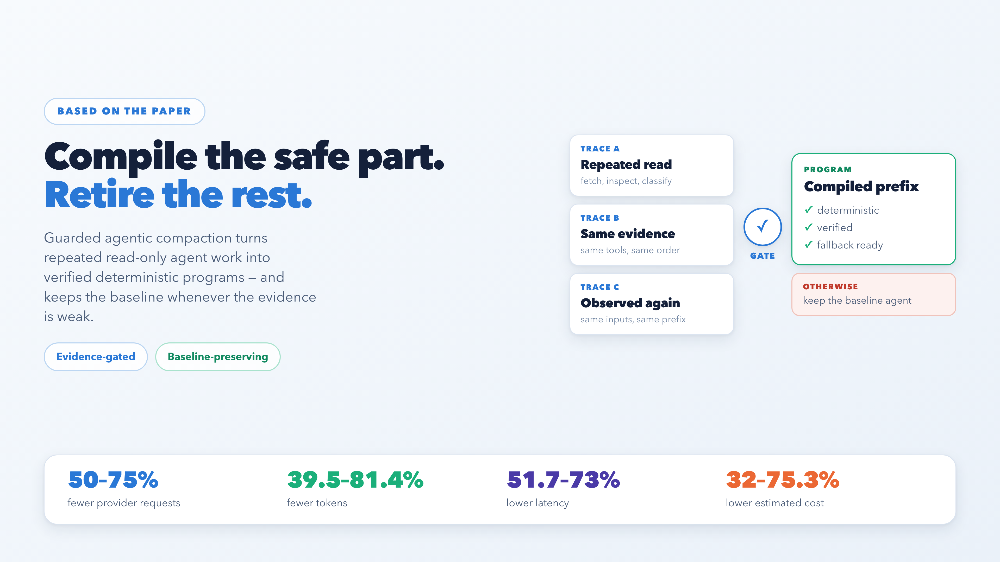
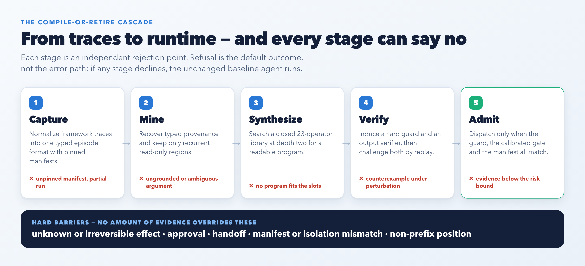
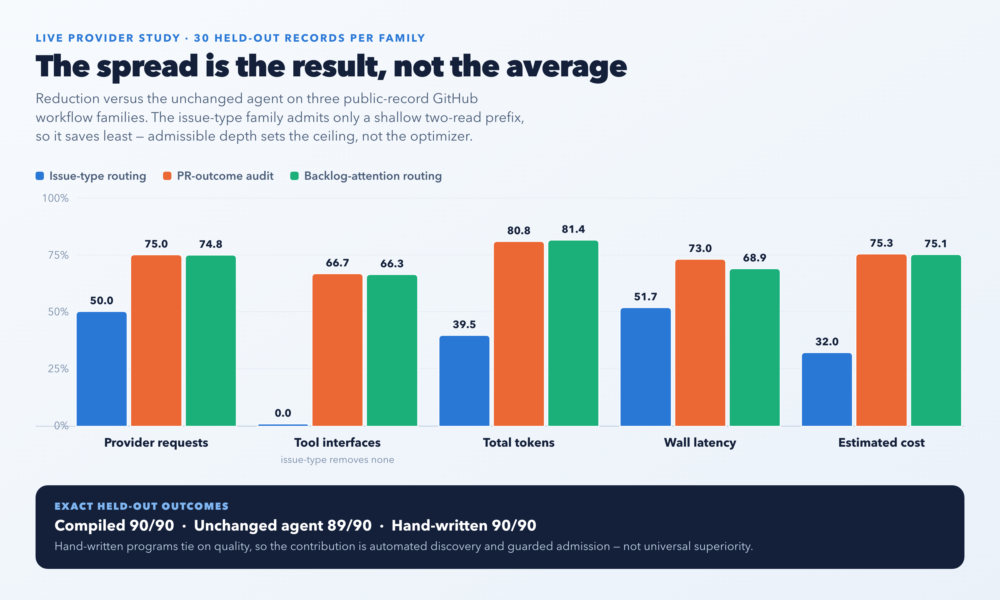
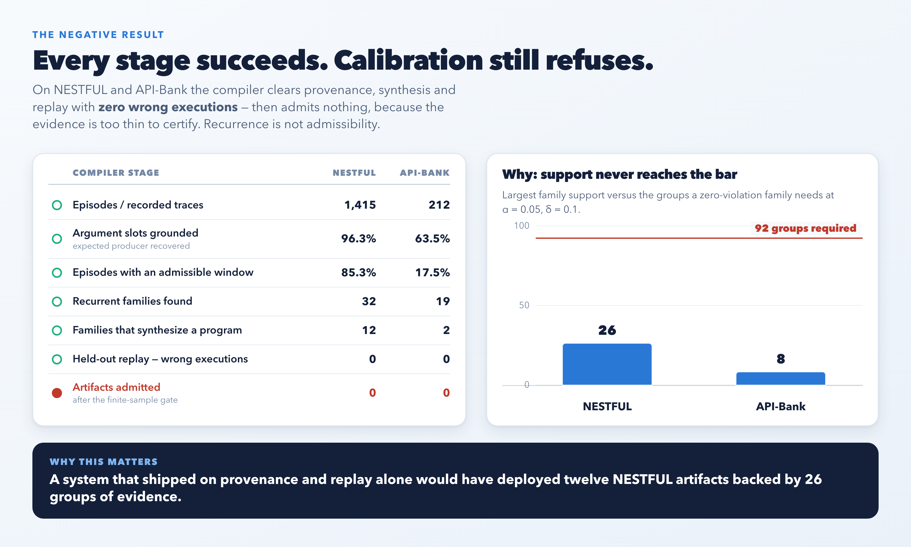
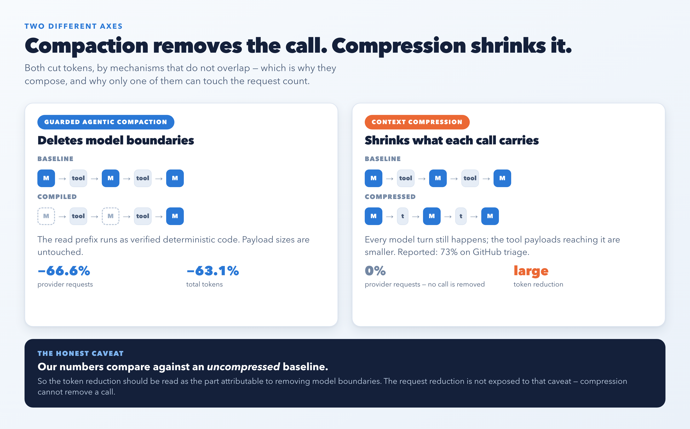
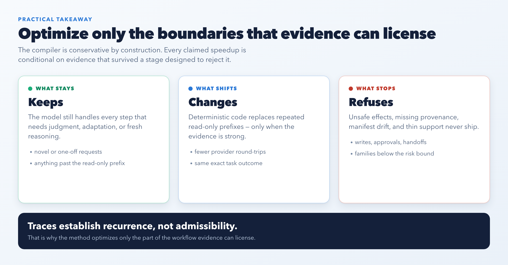

# When AI Agents Repeat Themselves: Compile the Safe Part, Retire the Rest

*How guarded agentic compaction turns recurring read-only agent work into verified deterministic programs*

## Why repeated agent loops get expensive

Tool-using agents are strong at solving new problems, but many production workflows become repetitive. The same read-only evidence gathering steps show up again and again: fetch a record, inspect a label, read comments, classify an item, and then ask the model for another decision. Every repeated model turn adds latency, token usage, and cost.

That sounds like caching, but it is not. A later tool argument may depend on a previous observation, a nominally read-only step may still have a hidden side effect, and a workflow that looks safe in one trace can fail under a different permission, freshness, or contract constraint. In other words, speed is only useful when the faster path is still the right path.

## What guarded agentic compaction does

The paper introduces guarded agentic compaction (GAC), a trace-to-program compiler that looks for recurrent read-only prefixes and converts only the supported part into deterministic code. Everything that the evidence does not determine stays with the model.

The key design choice is conservative by construction: the default outcome is refusal. GAC compiles a prefix only when typed provenance, effect declarations, manifest compatibility, bounded synthesis, verification, and finite-sample admission all line up. If any part is missing, the baseline agent remains unchanged.

## What the experiments showed

Across three public-record GitHub workflow families with live provider calls, the compiled system matched 90/90 exact outcomes, the unchanged agent reached 89/90, and a hand-written program also reached 90/90. The paper's claim is therefore not universal superiority. It is automated discovery, guarded admission, and disciplined fallback.

The averages are the least interesting part. What matters is the spread: the issue-type family admits only a shallow two-read prefix and saves least, while the two deeper families approach the ceiling of what the workload allows. Admissible depth sets the savings, not the optimizer.

## When the compiler refuses

The most useful result is the one where nothing ships. On the NESTFUL and API-Bank benchmarks, GAC recovers provenance, synthesizes programs, and replays them on held-out data with **zero wrong executions** — and then admits nothing at all, because the largest recurrent family is backed by 26 groups of evidence where the risk bound needs 92.

That is the whole thesis in one number. Recurrence is a property of a trace. Admissibility is a property of the evidence. A system that shipped on the first two stages alone would have deployed twelve artifacts it could not certify.

## How this differs from context compression

A reasonable question is whether this is just compression by another name. It is not, and the distinction is worth stating plainly. Context-compression middleware such as [Headroom](https://github.com/headroomlabs-ai/headroom) shrinks what goes *into* a call, reporting large token reductions on similar workloads. It never removes a model turn, so it cannot reduce provider requests at all. Guarded agentic compaction removes the turn and leaves the payload alone.

The two compose. The honest caveat is that the numbers above compare against an uncompressed baseline, so the token reduction should be read as the part attributable to removing model boundaries.

## What the results do not claim

The paper is careful not to overstate. It does not claim semantic equivalence, production certification, automatic API fusion, or universal superiority over hand-written code.

> Traces establish recurrence, not admissibility.

## Practical takeaway

For teams building AI agents, the lesson is simple but useful: do not optimize every boundary. Optimize only the boundaries that can be licensed by evidence, and preserve the baseline everywhere else. That keeps the system fast where it can be fast and honest where it must remain flexible.

---

Based on the paper *From Traces to Guarded Programs: Evidence-Gated Compilation of Recurrent Agent Workflows* by Reza Rahimi.
